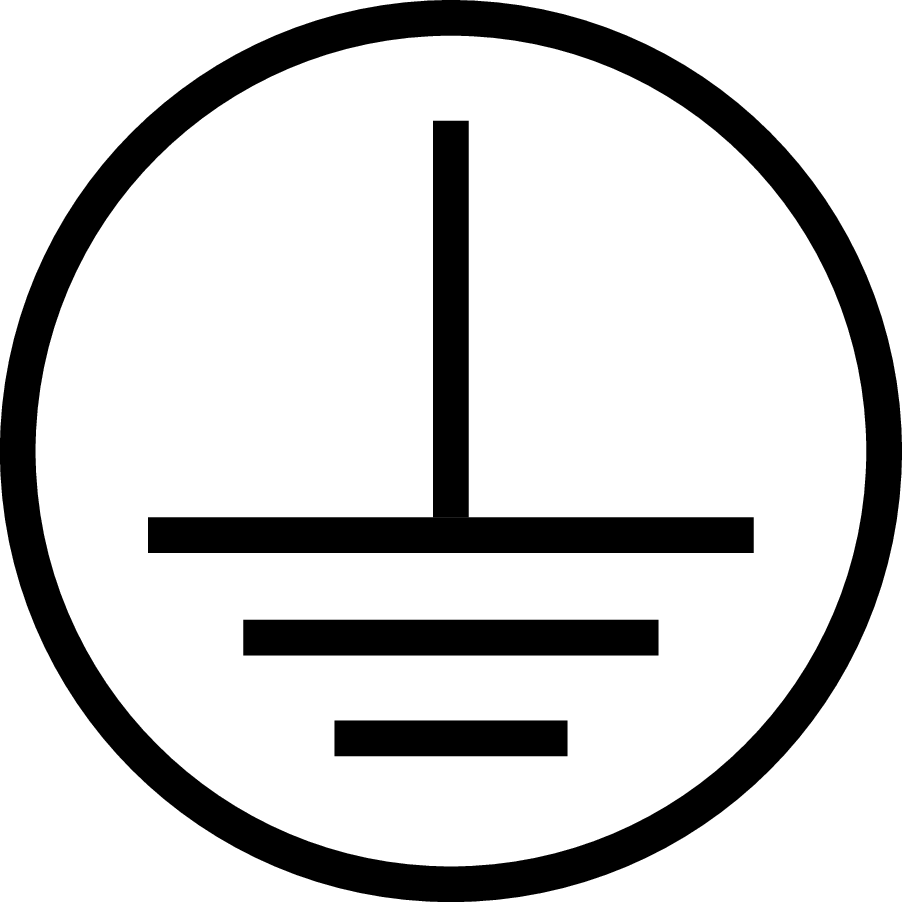
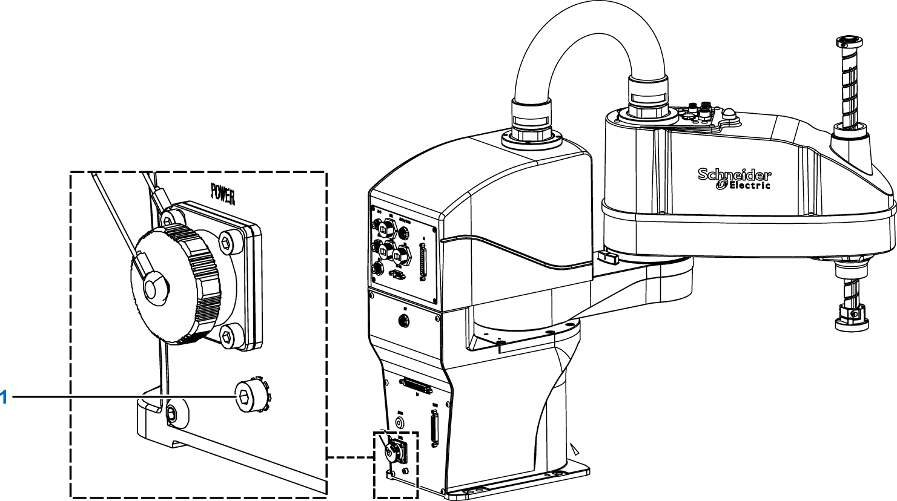

# Grounding the Robot

## Grounding the Robot

Feed and fasten the protective ground (earth) cable to the protective ground (earth) connection (1) of the robot housing. Use a wire of minimum 1.5 mm². The ground connection is marked with the following symbol:

NOTE: For the specifics of the requirement of the ground wire, follow the local standards and applicable regulations for a protective ground (earth).

| DANGER | |
| --- | --- |
|  | ELECTRIC SHOCK DUE TO IMPROPER GROUNDING  Ground robot components in accordance with local, regional and/or national standards and regulations at a single, central point.  Failure to follow these instructions will result in death or serious injury. |

Multipoint grounding is permissible if connections are made to an equipotential ground plane dimensioned to help avoid cable shield damage in the event of power system short-circuit currents.

## Local Standards and Regulations

For the specifics of the requirement of the ground wire, refer to the following local standards and regulations.

| Nation | Standard |
| --- | --- |
| China | GB/T 5226.1 |
| EU | EN 60204-1 |
| England | BS EN 60204-1 |
| US | UL 1740 |
| Canada | CAN/CSA-Z434-14 |

EIO0000005360.00