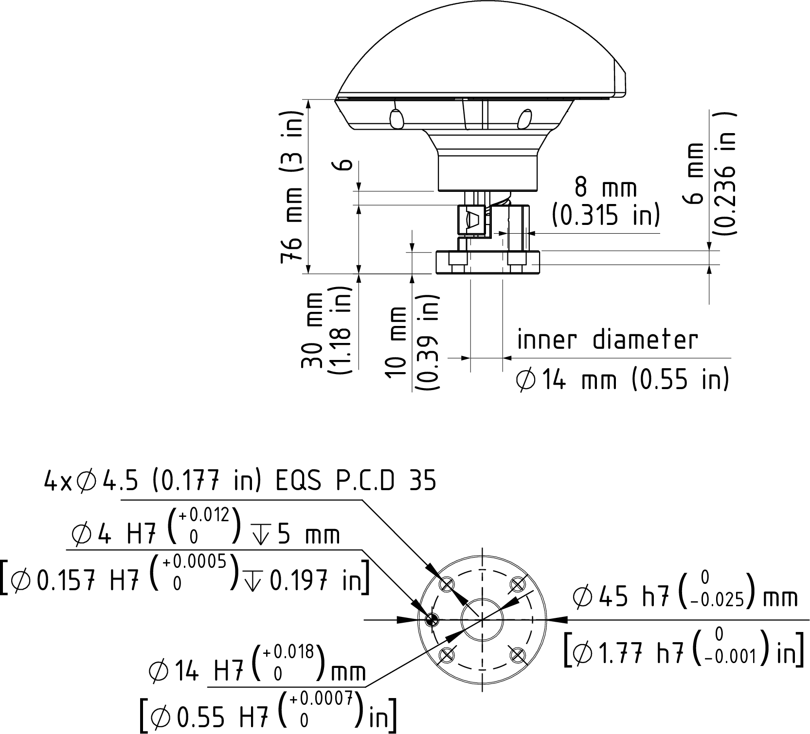
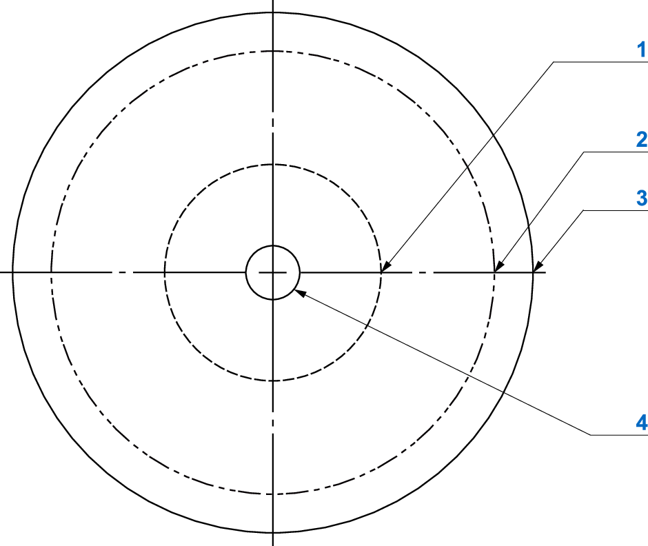

# Mounting the End-Effector

## Tool Flange Dimensions

## Center of Payload Mass

In a typical application the payload may be off-centered relative to joint 4 rotation axis. The following diagram presents the maximum radius of a payload center-of-mass, based on the following setup conditions:

* Rated payload and rated inertia
* Maximum payload and maximum inertia
* Rated payload and maximum inertia

Note that the assumed payload is relatively compact, similar to a point mass.

Calculate the load inertia with the following formula:

load inertia = load mass × distance from the load center of mass to the center of rotation

**1** 70 mm (2.76 in) - rated payload (2 kg (4.4 lb) and rated inertia

**2** 141 mm (5.6 in) - maximum payload (6 kg (13.2 lb) and maximum inertia

**3** 150 mm (5.9 in) - rated payload (2 kg (4.4 lb) and maximum inertia

**4** Joint 4 rotation center

EIO0000005360.00