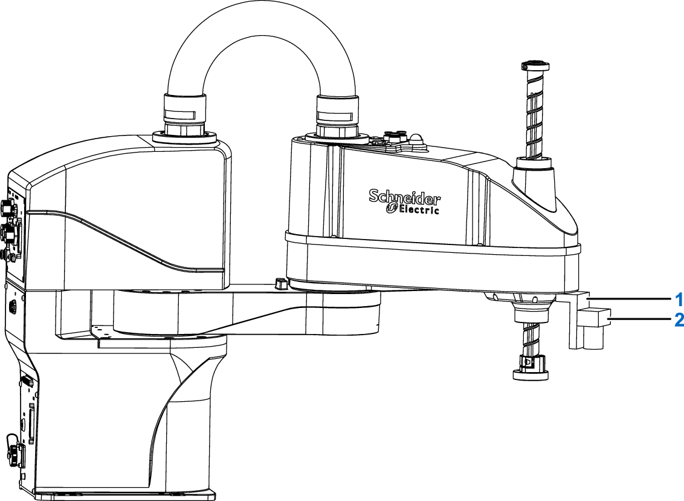

# Installation of End-of-Arm Camera

## Overview

External equipment such as a vision camera, solenoid valve, and so on, can be mounted at the end of the robot arm. Mounting holes are pre-drilled for this purpose. You can design a mounting bracket that meets your specific requirements.

An example of an end-of-arm camera mounting is presented in the following figure.

**1** Mounting bracket

**2** Camera

M4 mounting screws are not included with the robot.

EIO0000005360.00