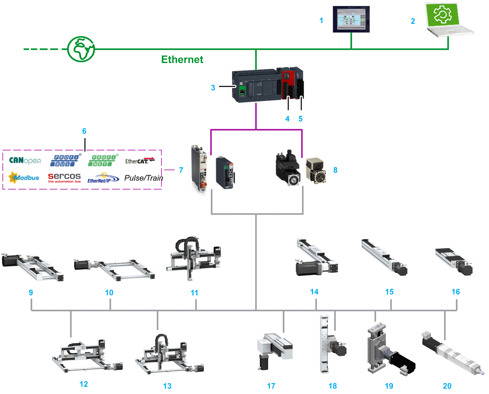

# Overview

Overview

The control system consists of several components, depending on its application. The following figure presents an example of a control system.

|  |  |  |
| --- | --- | --- |
| 1 Magelis HMI  2 SoMachine Motion /  EcoStruxure Machine Expert  3 Logic/Motion Controller  4 Safety Module  5 I/O Module  6 Communication Interfaces | 7 Drives  8 Integrated Drives  9 Lexium MAXH-Series  10 Lexium MAXS-Series  11 Lexium MAXP-Series  12 Lexium MAXR•2-Series  13 Lexium MAXR•3-Series | 14 Lexium PAS4•B-Series  15 Lexium PAS4•S-Series  16 Lexium TAS4-Series  17 Lexium CAS2-Series  18 Lexium CAS4-Series  19 Lexium CAR4-Series  20 Lexium EAC1-Series |

For more information about the several components, refer to the corresponding documentation at www.schneider-electric.com.

The following graphic presents an example of a PacDrive 3 system.

|  |  |
| --- | --- |
| 1 Magelis HMI  2 SoMachine Motion / EcoStruxure Machine Expert  3 Motion Controller  4 Safety Controller  5 I/O  6 Drives  7 Motors | 8 Single Axes (PAS, TAS, CAS, CAR, EAC)  9 Multi-Axis Systems (MAXH, MAXS, MAXP, MAXR)  10 Delta-2 Robots (T-Series)  11 Delta-3 Robots (P-Series)  12 SCARA Robots (S-Series)  13 Articulated Robots |

For more information about the several components, refer to the corresponding documentation at www.schneider-electric.com.