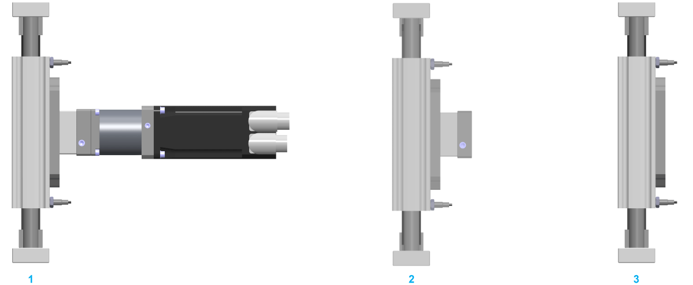

# Mounting Options for the Motor and/or Gearbox

Mounting Options for the Motor and/or Gearbox

The following figure presents the mounting options for the motor and/or gearbox for the .

1   Motor and/or gearbox mounted on right-hand side

2   Adaptation material mounted on right-hand side

3   Without motor or gearbox