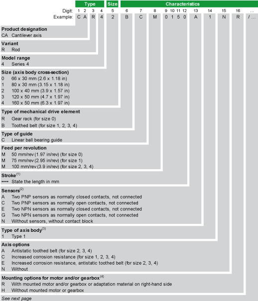
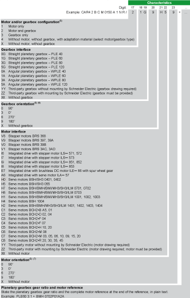

# Presentation

Presentation

To find your appropriate axis information, refer to the [type plate located at the axis](ROBOTICS_System_Overview-5.htm#XREF_D_SE_0088597_1).

(1)   For the minimum and maximum stroke per size, refer to the [mechanical data of the axis](../ROBOTICS_Technical_Data/ROBOTICS_Technical_Data-3.htm#XREF_D_SE_0088553_1).

(2)   Supplied with a 0.1 m (3.9 in) cable which is equipped with an M8 connector. For other sensor extension cable lengths, refer to [Sensor Extension Cables](../ROBOTICS_Replacement_Equipment/ROBOTICS_Replacement_Equipment-3.htm#XREF_D_SE_0076671_9).

(3)   For information about the dimensions, refer to [Mechanical Data](../ROBOTICS_Technical_Data/ROBOTICS_Technical_Data-3.htm#XREF_D_SE_0088553_1).

(4)   For further information, refer to [Mounting Options for Motor and/or Gearbox](ROBOTICS_System_Overview-3.htm#XREF_D_SE_0067138_17).

(5)   For further information, refer to [Motor and/or Gearbox Orientation and Configuration](#XREF_D_SE_0067137_4).

(6)   In case of a straight planetary gearbox, the orientation references to the setscrew of the motor adapter plate.

(7)   With reference to the motor connection.