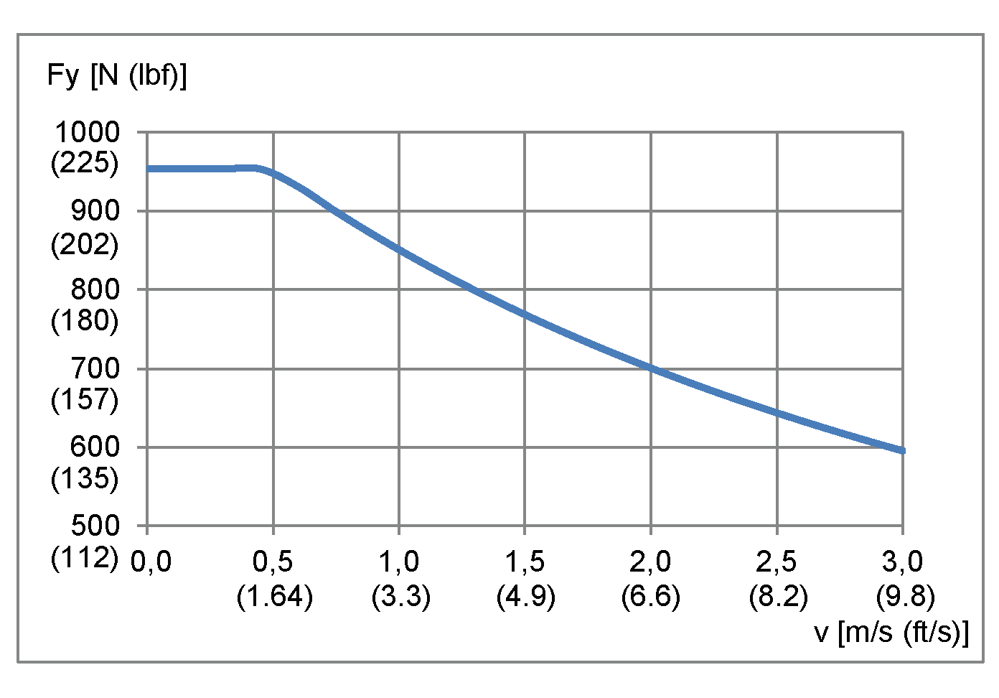
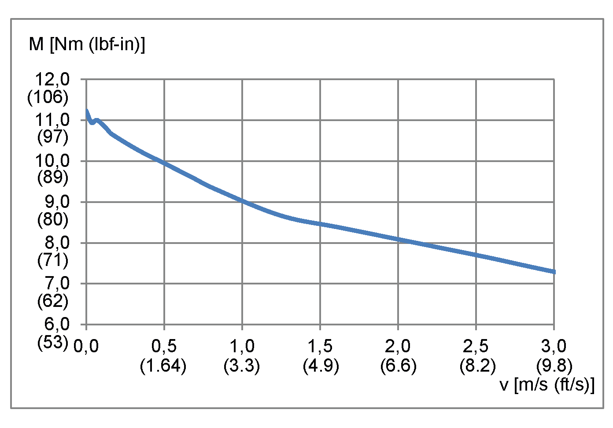
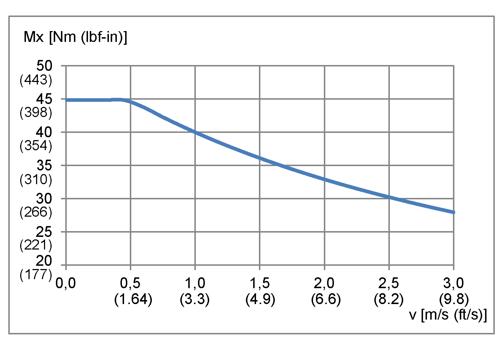
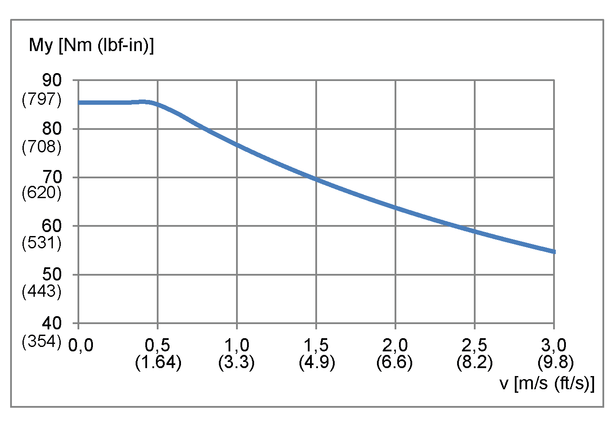
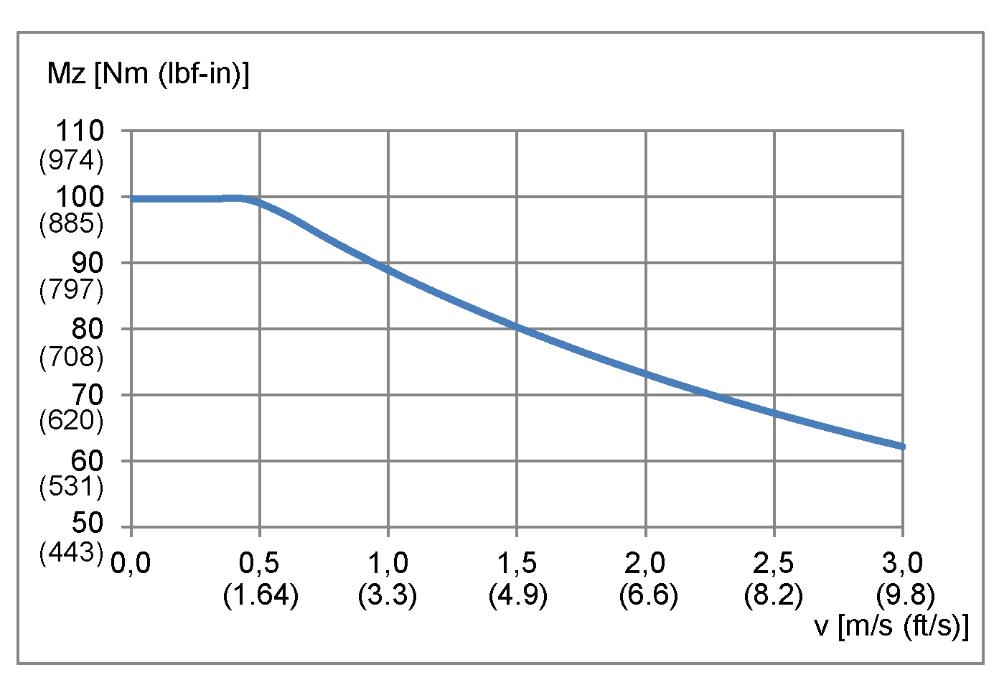

# Characteristic Curves of Lexium CAR44BC

Characteristic Curves of Lexium CAR44BC

Maximum feed force Fxmax

Maximum force Fy

Maximum force Fz

Maximum drive torque Mmax

Maximum torque end plate Mx

Maximum torque end plate My

Maximum torque end plate Mz

Service Life

A The forces and torques (Fy, Fz, Mx, Mz, My) are calculated for an expected service life of . This is shown with k factor equal 1.0 in the figure.