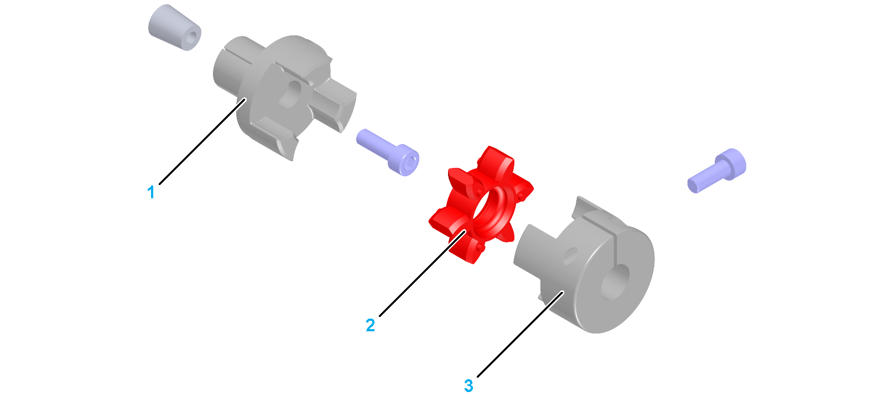

# Coupling Assemblies for Motor and Gearbox Mounting

Coupling Assemblies for Motor and Gearbox Mounting

A coupling assembly is required to mount a motor or a gearbox to the axis. It consists of the following components:

1   Expanding hub

2   Elastomer spider

3   Clamping hub