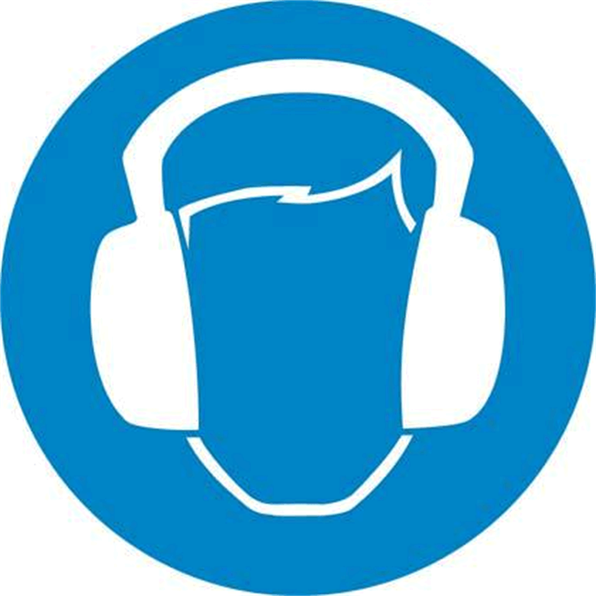

# Residual Risks

Residual Risks

Overview

Risks arising from the axis have been reduced. However a residual risk remains since the axis is moved and operated with electrical voltage and electrical currents.

If activities involve residual risks, a safety message is made at the appropriate points. This includes potential hazards that may arise, their possible consequences, and describes preventive measures to avoid the hazards.

Electrical Parts

To operate the axis described herein automated, you must have a drive and motor connected. As a system, residual risks exist and you must account for them in your risk analysis of your application. For more information, consult your drive and motor documentation.

|  |
| --- |
| DangerElectrical_Color.gifDanger_Color.gifDANGER |
| ELECTRIC SHOCK, EXPLOSION, OR ARC FLASH |
| oDisconnect all power from all equipment including connected devices prior to removing any covers or doors, or installing or removing any accessories, hardware, cables, or wires except under the specific conditions specified in the appropriate hardware guide for this equipment.  oAlways use a properly rated voltage sensing device to confirm the power is off where and when indicated.  oOperate electrical components only with a connected protective ground (earth) cable.  oVerify the secure connection of the protective ground (earth) cable to all electrical devices to ensure that connection complies with the connection diagram.  oDo not touch the electrical connection points of the components when the module is energized.  oProvide protection against indirect contact (EN 50178).  oInsulate any unused conductors on both ends of the motor cable. |
| Failure to follow these instructions will result in death or serious injury. |

Emergency Stop

The axis is not supplied with external brakes nor an emergency stop switch to engage any external brakes. However, the motor can be supplied with an internal holding brake (as an option depending on the motor reference).

For more information about the motor, record the motor reference on the type plate and refer to the corresponding motor manual.

|  |
| --- |
| Warning_Color.gifWARNING |
| ENTRAPMENT BY AXIS |
| oProvide means for ensuring that the motors can be put into a voltage-free state with any internal holding brake or external service brake released.  oMake available those means to allow one person to manually move the axis within reach of the zone of operation. |
| Failure to follow these instructions can result in death, serious injury, or equipment damage. |

The opening of the motor holding brake may cause the axis to move.

Mounted in vertical or tilted position, the axis can move unexpectedly.

|  |
| --- |
| Warning_Color.gifWARNING |
| MOVING PARTS OF THE EQUIPMENT |
| Ensure that releasing the brake poses no subsequent risks in the zone of operation. |
| Failure to follow these instructions can result in death, serious injury, or equipment damage. |

NOTE: Provide separation devices for all infeed energies. It must be possible to secure the separation devices in de-energized position, for example, by locking.

Assembly and Handling

|  |
| --- |
| Warning_Color.gifWARNING |
| CRUSHING, SHEARING, CUTTING AND HITTING DURING HANDLING |
| oObserve the general construction and safety regulations for handling and assembly.  oUse appropriate mounting and transport equipment and use appropriate tools.  oPrevent clamping and crushing by taking appropriate precautions.  oCover edges and angles to protect against cutting damage.  oWear suitable protective clothing (for example, protective goggles, protective boots, protective gloves). |
| Failure to follow these instructions can result in death, serious injury, or equipment damage. |

Axis Motion

Parts of the axis can move at high speeds. In such cases, the payload weight, additionally installed tools, and shifts in the center of gravity of the moving parts contribute to the total energy of the forces generated.

Motion sequences can occur when operating with the axis, which allow operational staff to make misjudgments. For safety considerations (according to EN ISO 13849-1), consider the controller and the brake as non-safety-related elements. Ensure that necessary protective measures are implemented.

The safety standards and directives for the respective country where the axis is in use define which protective measures are appropriate. Additionally, the system engineer who is responsible for the integration of the axis must evaluate which measures have to be taken.

NOTE: The configuration of the axis, the Tool Center Point (TCP) velocity, as well as the additional payload have an effect on the total energy, which can potentially be a source of damage and injury.

|  |
| --- |
| Warning_Color.gifWARNING |
| CRUSHING, SHEARING, CUTTING AND IMPACT INJURY |
| oThe axis must be operated only within an enclosure.  oOpen or enter the enclosure for cleaning and maintenance purposes only.  oDesign the enclosure to withstand an impact from the axis and to resist ejected parts from escaping the zone of operation.  oDesign the enclosure to safely deactivate the axis as soon as a person enters the zone of operation of the axis.  oAll barriers, protective doors, contact mats, light barriers, and other protective equipment, must be configured correctly and enabled whenever the axis is under power.  oDefine the clearance distance to the zone of operation of the axis so that operational staff do not have access to, nor can be enclosed in, the axis zone of operation.  oDesign the enclosure to account for the maximum possible travel paths of the axis; that is, the maximum path until the hardware safety system limits as well as the additional run-on paths, in case of a power interruption. |
| Failure to follow these instructions can result in death, serious injury, or equipment damage. |

|  |
| --- |
| Warning_Color.gifWARNING |
| BREAKDOWN OF THE INTERNAL MOTOR HOLDING BRAKE |
| oDo not consider the internal motor holding brake to be a functional safety device.  oTake into account a possible breakdown of the internal motor holding brake during your safety analysis. |
| Failure to follow these instructions can result in death, serious injury, or equipment damage. |

|  |
| --- |
| Warning_Color.gifWARNING |
| DEVIATION FROM THE SPECIFIED MOVEMENT |
| oUse the buffering of the 24 Vdc supply (UPS) in order to enable a controlled stop of the axis, in accordance with stop category 1, by making use of the stored residual mechanical and electrical energy.  oIf the power supply of the control system fails, the axis deviates from the specified movement in an uncontrolled manner whether the motor has a brake or not.  oIdeally use a synchronous stop on the path to avoid collisions with obstacles.  oObserve the extension of the run-on path during the safety considerations. |
| Failure to follow these instructions can result in death, serious injury, or equipment damage. |

Hot Surfaces

The motor, the gearbox, and the adaptation materials of the axis may exceed 70 °C (158 °F) when subjected to heavy loads and/or high performance during operation.

|  |
| --- |
| Warning_Color.gifWARNING |
| HOT SURFACES |
| oAvoid unprotected contact with hot surfaces.  oDo not allow flammable or heat-sensitive parts in the immediate vicinity of hot surfaces.  oVerify that the heat dissipation is sufficient by performing a test run under maximum load conditions. |
| Failure to follow these instructions can result in death, serious injury, or equipment damage. |

Hazardous Movements

There can be different sources of hazardous movements:

oNo or incorrect calibration of the drive

oWiring or cabling errors

oErrors in the application program

oComponent errors

oError in the measured value and signal transmitter

NOTE: Provide for personal safety by primary equipment monitoring or measures. Do not rely only on the internal monitoring of the drive components. Adapt the monitoring or other arrangements and measures to the specific conditions of the installation in accordance with a hazard and risk analysis.

|  |
| --- |
| Danger_Color.gifDANGER |
| UNAVAILABLE OR INADEQUATE PROTECTION DEVICE(S) |
| oPrevent entry to a zone of operation with, for example, protective fencing, mesh guards, protective coverings, or light barriers.  oDimension the protective devices properly and do not remove or modify them.  oDo not make any modifications that can degrade, incapacitate, or in any way invalidate protection devices.  oBring the drives and the motors they control to a stop before accessing the drives or entering the zone of operation.  oProtect existing workstations and operating terminals against unauthorized operation.  oPosition emergency stop switches so that they are easily accessible and can be reached quickly.  oValidate the functionality of emergency stop equipment before start-up and during maintenance periods.  oPrevent unintentional start-up by disconnecting the power connection of the drives using the emergency stop circuit or using an appropriate lock-out tag-out sequence.  oValidate the system and installation before the initial start-up.  oAvoid operating high-frequency, remote control, and radio devices close to the system electronics and their feed lines.  oPerform, if necessary, a special electromagnetic compatibility (EMC) verification of the system. |
| Failure to follow these instructions will result in death or serious injury. |

Drive systems may perform unanticipated movements because of incorrect wiring, incorrect settings, incorrect data, or other errors.

|  |
| --- |
| Warning_Color.gifWARNING |
| UNINTENDED MOVEMENT OR AXIS OPERATION |
| oCarefully install the wiring in accordance with EMC standards.  oDo not operate the axis with undetermined settings and data.  oPerform comprehensive commissioning tests that include verification of configuration settings and data that determine position and movement. |
| Failure to follow these instructions can result in death, serious injury, or equipment damage. |

Noise Protection

The noise level of the axis depends on the basic cycle and the payload, as well as on further application-specific accessory parts. Be aware of the fact that noise emissions multiply when several axes are in use at the same time. If noise emissions reach a value of more than 70 dBA, wear a hearing protection.

|  |
| --- |
| Caution_Color.gifCAUTION |
| NOISE EMISSIONS OF THE AXIS |
| oWear hearing protection in accordance with the locally applicable regulations.  oAttach a sign on the axis if the noise emissions reach an excessive value. |
| Failure to follow these instructions can result in injury or equipment damage. |

NOTE: Attach the following symbol where it can easily be seen on the axis.

Emissions

Some small amount of oil emissions are to be expected over time. However, excessive oil emissions on or at the gearbox may be an indication of a damaged axis.

|  |
| --- |
| NOTICE |
| INOPERABLE EQUIPMENT INDICATED BY GEARBOX OIL EMISSIONS |
| oVerify the axis before, during, and after use.  oShut down the axis immediately if oil emissions appear on the axis. |
| Failure to follow these instructions can result in equipment damage. |

Hanging Loads

The axis is capable of suspending heavy loads.

|  |
| --- |
| Warning_Color.gifWARNING |
| FALLING LOADS |
| Keep away from loads that are suspended. |
| Failure to follow these instructions can result in death, serious injury, or equipment damage. |

Attachments or Modifications

|  |
| --- |
| Warning_Color.gifWARNING |
| UNINTENDED EQUIPMENT OPERATION |
| oDo not drill into or modify the axis.  oDo not modify the cable set.  oDo not modify the components of movable mechanics. |
| Failure to follow these instructions can result in death, serious injury, or equipment damage. |

Options for Moving the Axis Without Drive Energy

The axis is not equipped with an enclosure (see UL 1740).

NOTE: Take appropriate security measures concerning the specific use before operating the axis.

|  |
| --- |
| Warning_Color.gifWARNING |
| MOVING PARTS OF THE EQUIPMENT |
| Ensure that releasing the brake poses no subsequent risks in the zone of operation. |
| Failure to follow these instructions can result in death, serious injury, or equipment damage. |

EIO0000003043.01

© 2019 Schneider Electric. All rights reserved.