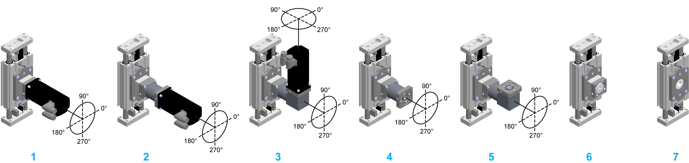

# Type Code

Type Code

Presentation

To find your appropriate axis information, refer to the [type plate located at the axis](ROBOTICS_System_Overview-5.htm#XREF_D_SE_0088597_1).

(1)   For the minimum and maximum stroke per size, refer to the [mechanical data of the axis](../ROBOTICS_Technical_Data/ROBOTICS_Technical_Data-3.htm#XREF_D_SE_0088553_1).

(2)   Supplied with a 0.1 m (3.9 in) cable which is equipped with an M8 connector. For other sensor extension cable lengths, refer to [Sensor Extension Cables](../ROBOTICS_Replacement_Equipment/ROBOTICS_Replacement_Equipment-3.htm#XREF_D_SE_0076671_9).

(3)   For information about the dimensions, refer to [Mechanical Data](../ROBOTICS_Technical_Data/ROBOTICS_Technical_Data-3.htm#XREF_D_SE_0088553_1).

(4)   For further information, refer to [Mounting Options for Motor and/or Gearbox](ROBOTICS_System_Overview-3.htm#XREF_D_SE_0067138_17).

(5)   For further information, refer to [Motor and/or Gearbox Orientation and Configuration](#XREF_D_SE_0067137_4).

(6)   In case of a straight planetary gearbox, the orientation references to the setscrew of the motor adapter plate.

(7)   With reference to the motor connection.

Motor and/or Gearbox Orientation and Configuration

The following figure presents the possible motor and/or gearbox orientation and configuration for the .

1   CAR4••C••••••••R/1XXX•••

2   CAR4••C••••••••R/2•G••••

3   CAR4••C••••••••R/2•A••••

4   CAR4••C••••••••R/3•G•••X

5   CAR4••C••••••••R/3•A•••X

6   CAR4••C••••••••R/4••X••X

7   CAR4••C••••••••H/XXXXXXX

For a detailed name description of the , refer to [Type Code](#XREF_D_SE_0067137_1).

Designation of Customized Versions

In the case of a customized version, the type code contains one or several dollar signs "$". Example: CAR42$CM0150A1NR / 2 1G 9 H5 9

If you have questions concerning customized versions, contact your local Schneider Electric service representative.

EIO0000003043.01

© 2019 Schneider Electric. All rights reserved.