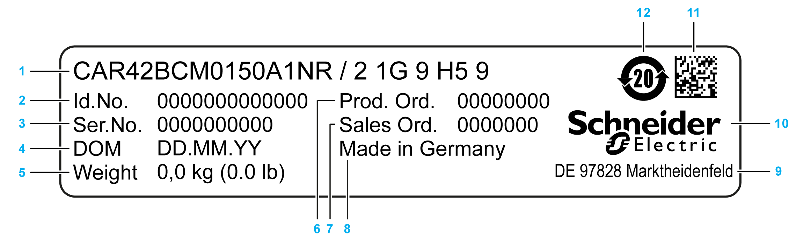

# Type Plate

Type Plate

Position of the Type Plate

|  |  |
| --- | --- |
| Representation for CAR40 / CAR41:  G-SE-0065045.1.gif-high.gif    1   Type plate | Representation for CAR42 / CAR43 / CAR44:  G-SE-0065046.1.gif-high.gif    1   Type plate |

Description of the Type Plate

The type plate contains the following data:

|  |  |
| --- | --- |
| 1 Product name\*  2 Identification number  3 Serial number  4 Date of manufacture  5 Weight of the axis  6 Product order number | 7 Sales order number  8 Country of origin  9 Production site  10 Schneider Electric logo  11 Data matrix code  12 RoHS mark |
| \* For detailed information about the meaning of the particular digits, refer to [Type Code](ROBOTICS_System_Overview-4.htm#XREF_D_SE_0067137_1). | |

EIO0000003043.01

© 2019 Schneider Electric. All rights reserved.