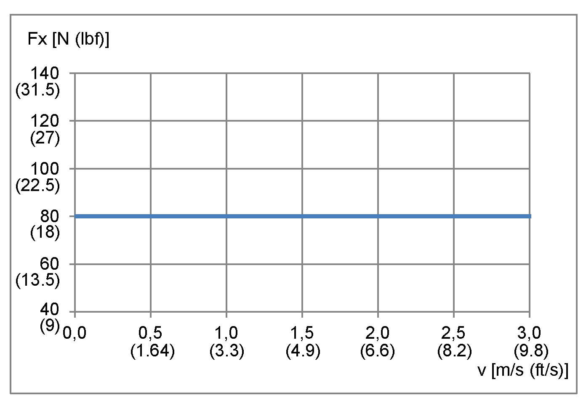
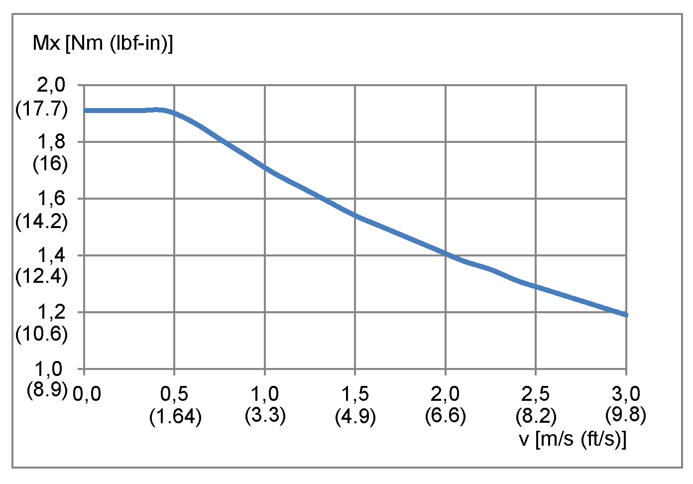
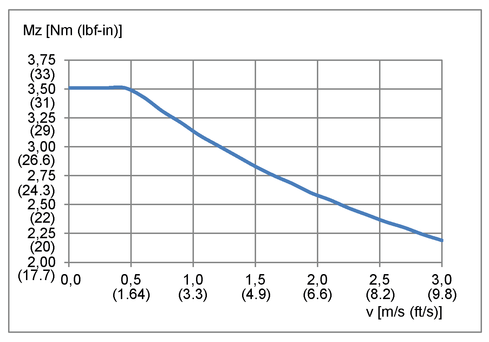

# Lexium CAR40RC

Lexium CAR40RC

Overview

Here you will find the following information:

o[Mechanical data of Lexium CAR40RC](#XREF_D_SE_0059163_5)

o[Characteristic curves of Lexium CAR40RC](#XREF_D_SE_0059163_6)

o[Dimensional drawing of Lexium CAR40RC](#XREF_D_SE_0059163_7)

Mechanical Data of Lexium CAR40RC

| Category | Parameter | Unit | Value for CAR40RC with axis body type 1 |
| --- | --- | --- | --- |
| General data | Type of mechanical drive element | – | Gear rack  Module, size 0.636 |
| Type of guide | – | Linear ball bearing guide, slide bearing guide |
| Minimum stroke(1) | mm  (in) | 8  (0.315) |
| Maximum stroke(2) | mm  (in) | 150  (5.9) |
| Maximum velocity(3) | m/s  (ft/s) | 3  (9.8) |
| Maximum acceleration(3) | m/s2  (ft/s2) | 20  (66) |
| [Feed constant](../glossary/glossary.htm#XREF_D_SE_0058496_36) | mm/rev  (in/rev) | 50  (1.97) |
| Effective diameter rack pinion | mm  (in) | 15.92  (0.63) |
| [Repeatability](../glossary/glossary.htm#XREF_D_SE_0058496_33)(3) | mm  (in) | +/- 0.05  (+/- 0.00197) |
| Forces and torques | Maximum drive torque Mmax | Nm  (lbf-in) | 0.6  (5.3) |
| [Breakaway torque](../glossary/glossary.htm#XREF_D_SE_0058496_34) for axis with 0 stroke | Nm  (lbf-in) | 0.1  (0.89) |
| Maximum feed force Fxmax | N  (lbf) | 80  (18) |
| Maximum force Fy(4) | N  (lbf) | 160  (36) |
| Maximum force Fz(4) | N  (lbf) | 130  (29) |
| Maximum torque end plate Mx(4) | Nm  (lbf-in) | 1.9  (16.8) |
| Maximum torque end plate My(4) | Nm  (lbf-in) | 2.8  (25) |
| Maximum torque end plate Mz(4) | Nm  (lbf-in) | 3.5  (31) |
| Weights | Mass for axis with 0 stroke | kg  (lb) | 0.6  (1.32) |
| Mass per 1 m (39 in) of stroke | kg/m  (lb/in) | 1.3  (0.073) |
| Moving mass of the cantilever | kg  (lb) | 0.4  (0.88) |
| Moments of inertias | Moment of inertia for axis with 0 stroke | kg·cm²  (lb·in²) | 0.3  (0.103) |
| Moment of inertia per 1 m (39 in) stroke | kg·cm²/m  (lb·in²/in) | 0.8  (0.007) |
| Moment of inertia per 1 kg (2.2 lb) payload | kg·cm²/kg  (lb·in²/lb) | 0.65  (0.1) |
| (1) Required for lubrication of the linear ball bearing guide.  (2) For information about greater strokes, contact your local Schneider Electric representative.  (3) Depending on load and stroke.  (4) Maximum permissible forces and torques decrease at increasing velocities. Refer to the characteristic curves following this table. | | | |

Characteristic Curves of Lexium CAR40RC

Maximum feed force Fxmax

Maximum force Fy

Maximum force Fz

Maximum drive torque Mmax

Maximum torque end plate Mx

Maximum torque end plate My

Maximum torque end plate Mz

[Service Life](../glossary/glossary.htm#XREF_D_SE_0058496_22)

A The forces and torques (Fy, Fz, Mx, Mz, My) are calculated for an expected service life of . This is shown with k factor equal 1.0 in the figure.

Dimensional Drawing of Lexium CAR40RC

EIO0000003043.01

© 2019 Schneider Electric. All rights reserved.