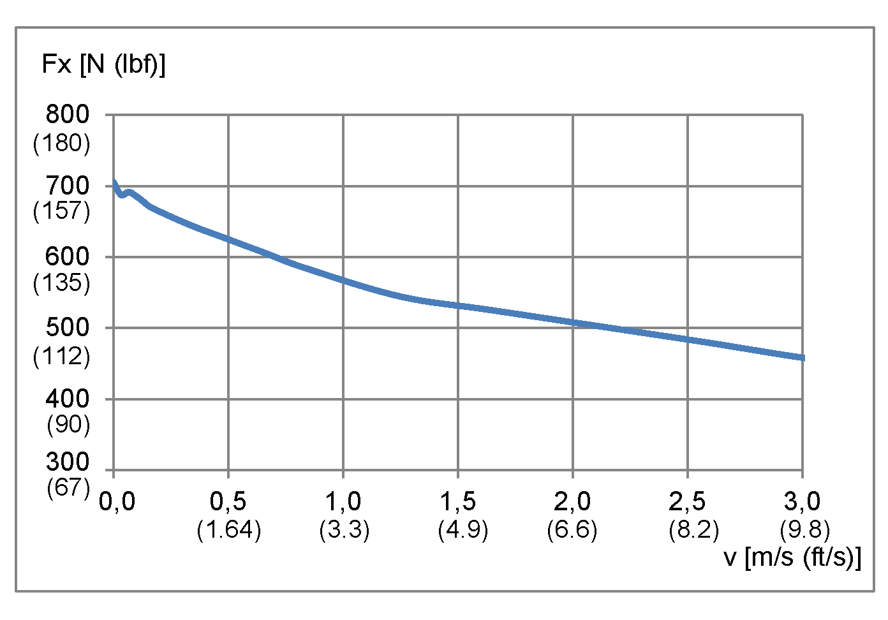
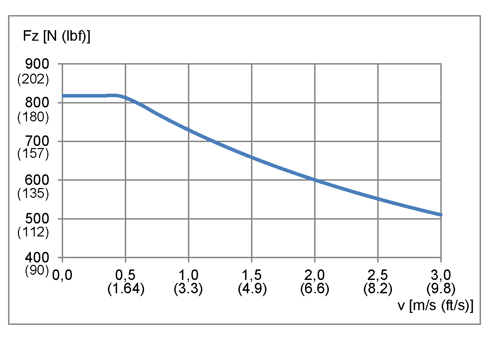
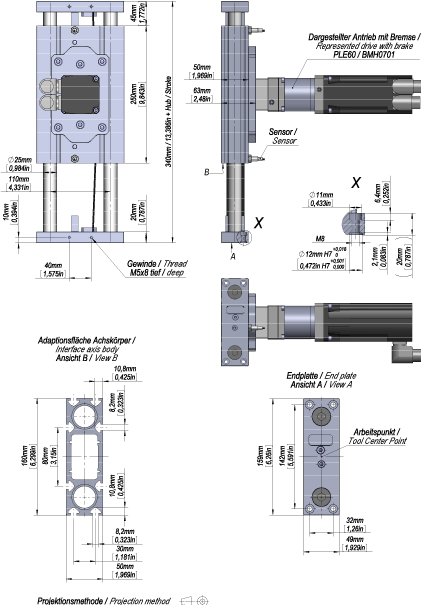

# Lexium CAR44BC

Lexium CAR44BC

Overview

Here you will find the following information:

o[Mechanical data of Lexium CAR44BC](#XREF_D_SE_0059170_5)

o[Characteristic curves of Lexium CAR44BC](#XREF_D_SE_0059170_6)

o[Dimensional drawing of Lexium CAR44BC](#XREF_D_SE_0059170_7)

Mechanical Data of Lexium CAR44BC

| Category | Parameter | Unit | Value for CAR44BC with axis body type 1 |
| --- | --- | --- | --- |
| General data | Type of mechanical drive element | – | Toothed belt 32AT5  Width: 32 mm (1.26 in)  Profile: AT  Pitch: 5 mm (0.197 in) |
| Type of guide | – | Linear ball bearing guide |
| Minimum stroke(1) | mm  (in) | 14  (0.55) |
| Maximum stroke(2) | mm  (in) | 500  (19.7) |
| Maximum velocity(3) | m/s  (ft/s) | 3  (9.8) |
| Maximum acceleration(3) | m/s2  (ft/s2) | 20  (66) |
| Feed constant | mm/rev  (in/rev) | 100  (3.9) |
| Effective diameter toothed belt | mm  (in) | 31.83  (1.25) |
| Repeatability(3) | mm  (in) | +/- 0.05  (+/- 0.00197) |
| Forces and torques | Maximum drive torque Mmax(4) | Nm  (lbf-in) | 11.5  (102) |
| Breakaway torque for axis with 0 stroke | Nm  (lbf-in) | 0.60  (5.3) |
| Maximum feed force Fxmax(4) | N  (lbf) | 705  (158) |
| Maximum force Fy(4) | N  (lbf) | 950  (214) |
| Maximum force Fz(4) | N  (lbf) | 820  (184) |
| Maximum torque end plate Mx(4) | Nm  (lbf-in) | 45  (398) |
| Maximum torque end plate My(4) | Nm  (lbf-in) | 85  (752) |
| Maximum torque end plate Mz(4) | Nm  (lbf-in) | 100  (885) |
| Weights | Mass for axis with 0 stroke | kg  (lb) | 5.9  (13) |
| Mass per 1 m (39 in) of stroke | kg/m  (lb/in) | 4.8  (0.27) |
| Moving mass of the cantilever | kg  (lb) | 4  (8.8) |
| Inertias | Moment of inertia for axis with 0 stroke | kg·cm²  (lb·in²) | 11.4  (3.89) |
| Moment of inertia per 1 m (39 in) stroke | kg·cm²/m  (lb·in²/in) | 12.2  (0.106) |
| Moment of inertia per 1 kg (2.2 lb) payload | kg·cm²/kg  (lb·in²/lb) | 2.55  (0.395) |
| (1) Required for lubrication of the linear ball bearing guide.  (2) For information about greater strokes, contact your local Schneider Electric representative.  (3) Depending on load and stroke.  (4) Maximum permissible forces and torques decrease at increasing velocities. Refer to the characteristic curves following this table. | | | |

Characteristic Curves of Lexium CAR44BC

Maximum feed force Fxmax

Maximum force Fy

Maximum force Fz

Maximum drive torque Mmax

Maximum torque end plate Mx

Maximum torque end plate My

Maximum torque end plate Mz

Service Life

A The forces and torques (Fy, Fz, Mx, Mz, My) are calculated for an expected service life of . This is shown with k factor equal 1.0 in the figure.

Dimensional Drawing of Lexium CAR44BC

EIO0000003043.01

© 2019 Schneider Electric. All rights reserved.