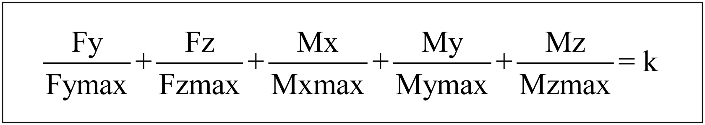

# Service Life

Service Life

Service Life

Presentation

The application-specific load values are entered in the numerator.

The denominator contains the maximum forces and torques of the axis. These forces and torques decrease at increasing velocities. For more information, refer to the respective characteristic curves of the forces and torques for the axis in [Mechanical Data](ROBOTICS_Technical_Data-3.htm#XREF_D_SE_0088553_1).

The service life of the axis can be approximated by using the respective service life characteristic curve and the load factor k. Refer to [Mechanical Data](ROBOTICS_Technical_Data-3.htm#XREF_D_SE_0088553_1) for the respective characteristic curve.

EIO0000003043.01

© 2019 Schneider Electric. All rights reserved.