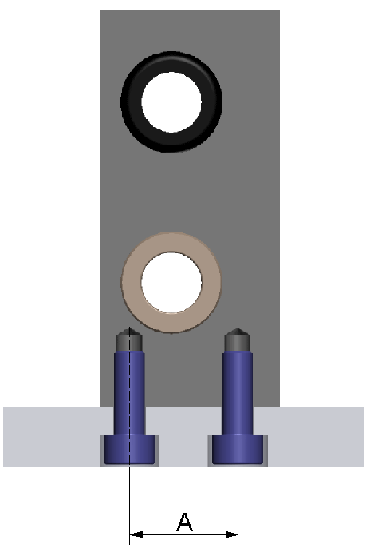

# Mounting the Axis

Mounting the Axis

Overview

To mount the axis to the installation surface, either use screws (for CAR40 / CAR41) or slot nuts (for CAR42 / CAR43 / CAR44).

For information about appropriate slot nuts, refer to [Replacement Equipment and Accessories](../ROBOTICS_Replacement_Equipment/ROBOTICS_Replacement_Equipment-1.htm#XREF_D_SE_0065517_1).

|  |
| --- |
| Warning_Color.gifWARNING |
| GREAT MASS OR FALLING PARTS |
| oUse a suitable crane or other suitable lifting gear to lift the axis if this is required by the mass of the axis.  oUse the necessary personal protective equipment (for example, safety shoes, safety glasses and protective gloves).  oMount the axis in such a way (tightening torque, securing screws) that parts cannot come loose, even in the case of shocks and vibration.  oTake all necessary measures to avoid unanticipated movements of the axis mounted in vertical or tilted positions. |
| Failure to follow these instructions can result in death, serious injury, or equipment damage. |

|  |
| --- |
| NOTICE |
| INCORRECT INSTALLATION |
| oIf motors with a cross section greater than the cross section of the axis body are used, the axis must be supported or the installation surface must be cut out as required. |
| Failure to follow these instructions can result in equipment damage. |

Running Accuracy

The length of the axis can have an impact on the running accuracy. A long axis may bend more easily, which can cause a reduced running accuracy. When mounting the axis, ensure that there is no gap between the axis and the installation surface so that the installation surface is in full contact with the mounting surface of the axis.

Dimensions for Mounting

The axis body of the Lexium CAR40 and CAR41 axis is an aluminum block.

The axis can be mounted to a frame by using several threads that are located on:

oThe narrow side at the CAR40 axis

oThe narrow side and the wide side at the CAR41 axis

The axis body of the CAR42, CAR43, and CAR44 axis is an extruded aluminum profile. The axis can be mounted to a frame by using appropriate slot nuts for the T-slots at the axis body.

The T-slots are located on:

oNarrow sides of the axis body

oWide sides of the axis body

CAR40:

|  |  |
| --- | --- |
| CAR41:  G-SE-0065044.1.gif-high.gif | G-SE-0065043.1.gif-high.gif |

|  |  |
| --- | --- |
| CAR42, CAR43, and CAR44:  G-SE-0057235.1.gif-high.gif | G-SE-0057236.1.gif-high.gif |

When mounting the axis, take into account the distance between the tapped holes for the slot nuts or screws stated below.

The following table presents the distance between the tapped holes and the appropriate screws:

| Description | Dimension | Unit | Value | |
| --- | --- | --- | --- | --- |
| CAR40 | CAR41 |
| Distance between tapped holes(1) | A | mm (in) | 18 (0.71) | 20 (0.79) |
| B | – | 70 (2.76) |
| Screw – ISO 4762 | – | – | M5 | M5 |
| (1) For further information, refer to the respective dimensional drawing in [Mechanical Data](../ROBOTICS_Technical_Data/ROBOTICS_Technical_Data-3.htm#XREF_D_SE_0088553_1). | | | | |

The following table presents the distance between the slots and the appropriate slot nuts and screws:

| Description | Dimension | Unit | Value | | |
| --- | --- | --- | --- | --- | --- |
| CAR42 | CAR43 | CAR44 |
| Distance between slots(1) | A | mm (in) | 25 (0.98) | 30 (1.18) | 30 (1.18) |
| B | 52 (2.05) | 65 (2.56) | 80 (3.15) |
| Slot nut type | A | 5 (0.197) | 8 (0.315) | 8 (0.315) |
| B | 8 (0.315) | 8 (0.315) | 8 (0.315) |
| Screw – ISO 4762 | A | – | M5 | M6 / M8 | M6 / M8 |
| B | – | M6 / M8 | M6 / M8 | M6 / M8 |
| (1) For further information, refer to the respective dimensional drawing in [Mechanical Data](../ROBOTICS_Technical_Data/ROBOTICS_Technical_Data-3.htm#XREF_D_SE_0088553_1). | | | | | |

NOTE:

oFor CAR40 / CAR41: Use at least four mounting points at the installation surface.

oFor CAR42 / CAR43 / CAR44: Use at least six mounting points at the installation surface.

Mounting the Axis

NOTE: When mounting the axis, keep in mind that it may have to be accessed for maintenance.

| Step | Action |
| --- | --- |
| 1 | Ensure that the planarity of the installation surface does not exceed 0.1 mm/m (0.0012 in/ft). |
| 2 | Carefully position the axis on its installation surface. |
| 3 | For CAR40 / CAR41: Tighten the fastening screws with a low tightening torque.  For CAR42 / CAR43 / CAR44: Tighten the fastening screws of the slot nut with a low tightening torque. |
| 4 | Provide a reference plane alongside the axis body. |
| 5 | Place a dial gauge onto the end plate. |
| 6 | Move the end plate and record the deviation regarding the reference plane over the entire stroke. |
| 7 | Correct the deviations by lateral alignment of the axis and by tightening the screws appropriately.  NOTE: Observe the [standard tightening torques](ROBOTICS_Transport_and_Comissioning-6.htm#XREF_D_SE_0088555_4). |

EIO0000003043.01

© 2019 Schneider Electric. All rights reserved.