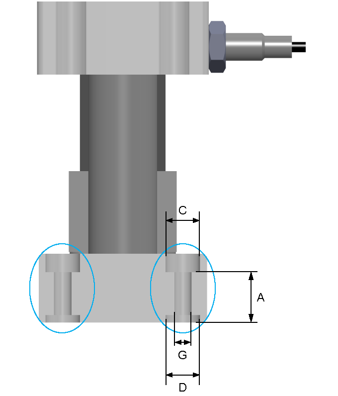

# Mounting the Payload

Mounting the Payload

Mounting the Payload

Overview

To fasten the payload, fastening threads and counterbores for screws with cylinder heads (counterbores according to DIN 974-1) are provided at the end plates.

Each thread has a counterbore for a locating dowel for reproducible mounting of the payload. For a section view of the end plate, refer to the dimensional drawing of the corresponding axis in [Mechanical Data](../ROBOTICS_Technical_Data/ROBOTICS_Technical_Data-3.htm#XREF_D_SE_0088553_1).

For suitable parts, refer to [Replacement Equipment and Accessories](../ROBOTICS_Replacement_Equipment/ROBOTICS_Replacement_Equipment-3.htm#XREF_D_SE_0076671_1).

Mounting Dimensions

The following table presents the dimensions for mounting the payload to the end plates:

| Description | Parameter | Unit | Value | | | | |
| --- | --- | --- | --- | --- | --- | --- | --- |
| CAR40 | CAR41 | CAR42 | CAR43 | CAR44 |
| Counterbore for screws with cylinder heads | C | – | M4 | M4 | M5 | M5 | M6 |
| Thread size | G | – | – | M5 | M6 | M6 | M8 |
| Total depth (thread and counterbore for locating dowel) | A | mm  (in) | – | 10.6  (0.42) | 14.6  (0.57) | 14.6  (0.57) | 13.6  (0.54) |
| Counterbore diameter for locating dowel | D | mm  (in) | 8 H7  (0.315) | 8 H7  (0.315) | 10 H7  (0.39) | 10 H7  (0.39) | 12 H7  (0.47) |
| NOTE: For more information, refer to the respective dimensional drawing in [Mechanical Data](../ROBOTICS_Technical_Data/ROBOTICS_Technical_Data-3.htm#XREF_D_SE_0088553_1). | | | | | | | |

EIO0000003043.01

© 2019 Schneider Electric. All rights reserved.