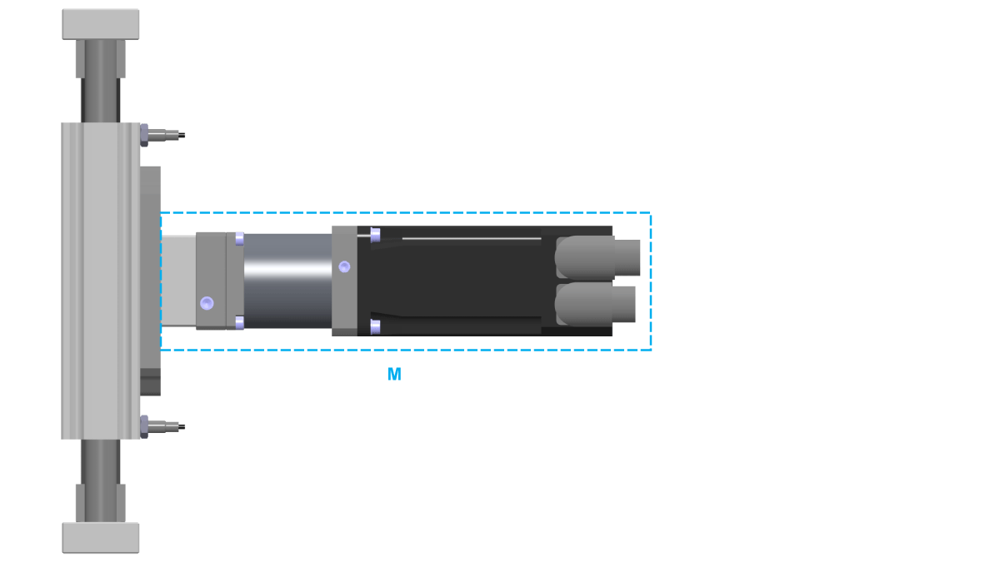

# Mounting the Motor and/or Gearbox

Mounting the Motor and/or Gearbox

Overview

Optionally, the axis is supplied with a pre-installed Schneider Electric motor and/or a gearbox.

Mounting Position of the Motor and Gearbox

In case of a new motor or gearbox, you can mount the new motor or gearbox to the side of the axis body on the axis. The motor and the gearbox can be mounted in different arrangements (turned in increments of 4 x 90°). For further information, refer to [Motor and/or Gearbox Orientation and Configuration](../ROBOTICS_System_Overview/ROBOTICS_System_Overview-4.htm#XREF_D_SE_0067137_4)

NOTE: The maximum mass of the installed parts is limited by the torque at the axis body.

Maximum Mass

The mass of the motor and/or gearbox which can be mounted to the axis body is limited.

M   Mass at axis body

The maximum mass of a motor and/or gearbox which can be mounted to the axis body depends on the size of the corresponding axis. The following table presents the maximum permissible masses of a mounted motor and/or gearbox:

| Parameter | Unit | Value | |
| --- | --- | --- | --- |
| CAR40  CAR41 | CAR42  CAR43  CAR44 |
| Maximum permissible mass | kg (lb) | 3.5 (7.72) | 11 (24.25) |

|  |
| --- |
| Warning_Color.gifWARNING |
| UNINTENDED EQUIPMENT OPERATION |
| Do not exceed the maximum permissible mass at the axis body. |
| Failure to follow these instructions can result in death, serious injury, or equipment damage. |

Maximum Torque

A mounted motor and/or gearbox causes a static overturning torque at the axis body. In case of a lateral acceleration of the complete axis, the mounted motor and/or gearbox cause an additional dynamic overturning torque. The total of the static and dynamic overturning torque is limited by the maximum overturning torque of the axis body adapter plate.

T   Torque at the end block

a   Lateral acceleration of the axis

The following table presents the maximum permissible torques of the mounted motor and/or gearbox at the axis body adapter plate:

| Parameter | Unit | Value | |
| --- | --- | --- | --- |
| CAR40  CAR41 | CAR42  CAR43  CAR44 |
| Maximum permissible torque (total of static and dynamic) | Nm (lbf-in) | 22 (195) | 150 (1328) |

NOTE: The total of the static and dynamic torques must not exceed the maximum permissible torque at the end block.

|  |
| --- |
| Warning_Color.gifWARNING |
| UNINTENDED EQUIPMENT OPERATION |
| Do not exceed the maximum permissible torque at the axis body. |
| Failure to follow these instructions can result in death, serious injury, or equipment damage. |

Third-Party Motors and Gearboxes

When choosing a third-party motor, take special care that the maximum drive torque is not exceeded. Otherwise the axis could be damaged or destroyed.

|  |
| --- |
| Warning_Color.gifWARNING |
| UNINTENDED MOVEMENTS |
| Observe the maximum permissible drive torque of the corresponding motor. |
| Failure to follow these instructions can result in death, serious injury, or equipment damage. |

|  |
| --- |
| Warning_Color.gifWARNING |
| FALLING HEAVY LOAD |
| Observe the limitations for the maximum permissible mass and the maximum permissible torque of the mounted motor and/or gearbox. |
| Failure to follow these instructions can result in death, serious injury, or equipment damage. |

Coupling Assemblies for Motor and Gearbox Mounting

A coupling assembly is required to mount a motor or a gearbox to the axis. It consists of the following components:

1   Expanding hub

2   Elastomer spider

3   Clamping hub

Prerequisites

You need the following tools to mount the motor and/or the gearbox:

oTorque wrench with a set of hexagon sockets

oCaliper gauge (for distance measurement)

NOTE: Do not use ball head hex keys. Excessive torque may cause the ball head to tear off. A torn off ball head is difficult to remove from the screw.

For suitable parts, refer to [Replacement Equipment and Accessories](../ROBOTICS_Replacement_Equipment/ROBOTICS_Replacement_Equipment-3.htm#XREF_D_SE_0076671_1).

Procedure Overview

Perform the following procedures to mount the motor and/or the gearbox:

o[Preparing the mounting of motor and gearbox](#XREF_D_SE_0067152_6)

o[Mounting the elastomer coupling](#XREF_D_SE_0067152_7)

o[Mounting the motor only](#XREF_D_SE_0067152_8)

o[Mounting the gearbox only](#XREF_D_SE_0067152_9)

o[Mounting the motor to the gearbox](#XREF_D_SE_0067152_16)

Preparing the Mounting of Motor and Gearbox

| Step | Action |
| --- | --- |
| 1 | Clean all parts. |
| 2 | Inspect all parts for damage. |

NOTE: Polluted or damaged parts may cause run-out which has an adverse effect on the service life of the axis.

|  |
| --- |
| NOTICE |
| UNINTENDED EQUIPMENT OPERATION |
| oReplace any damaged parts immediately.  oClean all parts before assembly and use. |
| Failure to follow these instructions can result in equipment damage. |

Mounting the Elastomer Coupling

| Step | Action |
| --- | --- |
| 1 | For CAR40: Insert the expanding hub into the hollow shaft of the rack pinion. Verify that there is no gap between the expanding hub and the rack pinion so that the installation surface is in full contact with the mounting surface of the axis.  For CAR41 / CAR42 / CAR43 / CAR44: Insert the expanding hub (1) into the hollow shaft of the toothed belt pulley (2). Verify that there is no gap between the expanding hub and the toothed belt pulley so that the installation surface is in full contact with the mounting surface of the axis.  G-SE-0061806.1.gif-high.gif |
| 2 | Manually move one end plate (4) into end position. |
| 3 | Tighten the screw (3) of the expanding hub.  Tightening torque:  oFor CAR40 / CAR41: 2.9 Nm (25.7 lbf-in)  oFor CAR42 / CAR43 / CAR44: 10 Nm (89 lbf-in)  NOTE: |
| 4 | Insert the elastomer spider (6) into the expanding hub.  G-SE-0061807.1.gif-high.gif      NOTE:  oIf the elastomer spider can be inserted too easily (without preloading), it must be replaced.  oSlightly greasing the elastomer spider or the clamping hub facilitates the fitting process. Use mineral oil-based lubricants without additives, or use silicon-based lubricants. |
| 5 | Fasten the coupling housing (5) to the axis body adapter plate (7) with the four screws (8). Use the [standard tightening torque](../ROBOTICS_Transport_and_Comissioning/ROBOTICS_Transport_and_Comissioning-6.htm#XREF_D_SE_0088555_4). Verify that there is no gap between the coupling housing and the axis body adapter plate so that the installation surface is in full contact with the mounting surface of the axis.  NOTE:  oAt CAR40, the coupling housing is mounted to the axis body.  oGreasing every centering collar provides easier dismounting. Use mineral oil-based lubricants without additives, or use silicon-based lubricants. |
| 6 | Insert the clamping hub (9) into the elastomer spider.  G-SE-0061808.1.gif-high.gif |
| 7 | Verify that the orientation of the clamping screw (10) is the same as the orientation of the motor or gearbox. For further information, refer to [Motor and/or Gearbox Orientation and Configuration](../ROBOTICS_System_Overview/ROBOTICS_System_Overview-4.htm#XREF_D_SE_0067137_4). |
| 8 | Verify dimension a of the clamping hub. Measure the dimension from the top of the clamping hub to the collar of the coupling housing.  Dimension a:  oFor CAR40 / CAR41: 8 mm (0.315 in)  oFor CAR42 / CAR43 / CAR44: 13 mm (0.51 in)  G-SE-0061809.2.gif-high.gif |

Mounting the Motor Only

| Step | Action |
| --- | --- |
| 1 | Fasten the motor adapter plate (1) to the coupling housing (2) with the four screws (3). Use the [standard tightening torque](../ROBOTICS_Transport_and_Comissioning/ROBOTICS_Transport_and_Comissioning-6.htm#XREF_D_SE_0088555_4).  Verify that:  oThere is no gap between the motor adapter plate and the coupling housing so that the installation surface is in full contact with the mounting surface of the axis.  oThe standard orientation of the setscrew is the same as shown in the following figure. For further information, refer to [Motor and/or Gearbox Orientation and Configuration](../ROBOTICS_System_Overview/ROBOTICS_System_Overview-4.htm#XREF_D_SE_0067137_4).  oThe clamping screw is accessible through the hole in the motor adapter plate.  G-SE-0061810.1.gif-high.gif      NOTE: Greasing every centering collar provides easier dismounting. Use mineral oil-based lubricants without additives, or use silicon-based lubricants. |
| 2 | Insert the motor (4) into the clamping hub (7) and onto the motor adapter plate and secure the motor from falling. Verify that there is no gap between the motor and the motor adapter plate so that the installation surface is in full contact with the mounting surface of the axis.  G-SE-0061813.1.gif-high.gif      NOTE: Greasing every centering collar provides easier dismounting. Use mineral oil-based lubricants without additives, or use silicon-based lubricants. |
| 3 | Fasten the motor with the four screws (5) and washers (6). Use the [standard tightening torque](../ROBOTICS_Transport_and_Comissioning/ROBOTICS_Transport_and_Comissioning-6.htm#XREF_D_SE_0088555_4). |
| 4 | Remove the setscrew (8) at the motor adapter plate.  G-SE-0061814.1.gif-high.gif |
| 5 | Tighten the screw of the clamping hub through the hole.  Tightening torque:  oFor CAR40 / CAR41: 1.9 Nm (16.8 lbf-in)  oFor CAR42 / CAR43 / CAR44: 14 Nm (124 lbf-in) |
| 6 | Insert the setscrew into the motor adapter plate and tighten it.  Tightening torque: 4 Nm (35.4 lbf-in) |

Mounting the Gearbox Only

| Step | Action |
| --- | --- |
| 1 | Fasten the motor adapter plate (1) to the coupling housing (2) with the four screws (3). Use the [standard tightening torque](../ROBOTICS_Transport_and_Comissioning/ROBOTICS_Transport_and_Comissioning-6.htm#XREF_D_SE_0088555_4).  Verify that:  oThere is no gap between the motor adapter plate and the coupling housing so that the installation surface is in full contact with the mounting surface of the axis.  oThe standard orientation of the setscrews is upwards. For further information, refer to [Motor and/or Gearbox Orientation and Configuration](../ROBOTICS_System_Overview/ROBOTICS_System_Overview-4.htm#XREF_D_SE_0067137_4).  oThe clamping screw is accessible through the hole in the motor adapter plate.  G-SE-0061810.1.gif-high.gif      NOTE: Greasing every centering collar provides easier dismounting. Use mineral oil-based lubricants without additives, or use silicon-based lubricants. |
| 2 | Fasten the flange plate (5) to the gearbox (6) with the four screws (4). Use the [standard tightening torque](../ROBOTICS_Transport_and_Comissioning/ROBOTICS_Transport_and_Comissioning-6.htm#XREF_D_SE_0088555_4). Verify that there is no gap between the flange plate and the gearbox so that the installation surface is in full contact with the mounting surface of the axis.  G-SE-0054308.3.gif-high.gif      NOTE: Greasing every centering collar provides easier dismounting. Use mineral oil-based lubricants without additives, or use silicon-based lubricants. |
| 3 | Insert the flange plate, complete with the gearbox, into the clamping hub and to the motor adapter plate and secure the gearbox from falling. Verify that there is no gap between the gearbox and the motor adapter plate so that the installation surface is in full contact with the mounting surface of the axis.  G-SE-0061811.2.gif-high.gif      NOTE: Greasing every centering collar provides easier dismounting. Use mineral oil-based lubricants without additives, or use silicon-based lubricants. |
| 4 | Fasten the flange plate, complete with the gearbox, with the four screws (7). Use the [standard tightening torque](../ROBOTICS_Transport_and_Comissioning/ROBOTICS_Transport_and_Comissioning-6.htm#XREF_D_SE_0088555_4). |
| 5 | Remove the setscrew (8) at the motor adapter plate.  G-SE-0061812.1.gif-high.gif |
| 6 | Tighten the screw of the clamping hub through the hole.  Tightening torque:  oFor CAR40 / CAR41: 1.9 Nm (16.8 lbf-in)  oFor CAR42 / CAR43 / CAR44: 14 Nm (124 lbf-in) |
| 7 | Insert the setscrew into the motor adapter plate and tighten it.  Tightening torque: 4 Nm (35.4 lbf-in) |

Mounting the Motor to the Gearbox

|  |
| --- |
| NOTICE |
| DISTORTION OF MOTOR AND GEARBOX |
| Only fasten motor and gearbox with all components at the same ambient temperature. |
| Failure to follow these instructions can result in equipment damage. |

NOTE: If possible, fasten the motor to the gearbox in vertical position for easier mounting.

For more information about mounting the motor to the gearbox, refer to the corresponding gearbox manual.

EIO0000003043.01

© 2019 Schneider Electric. All rights reserved.