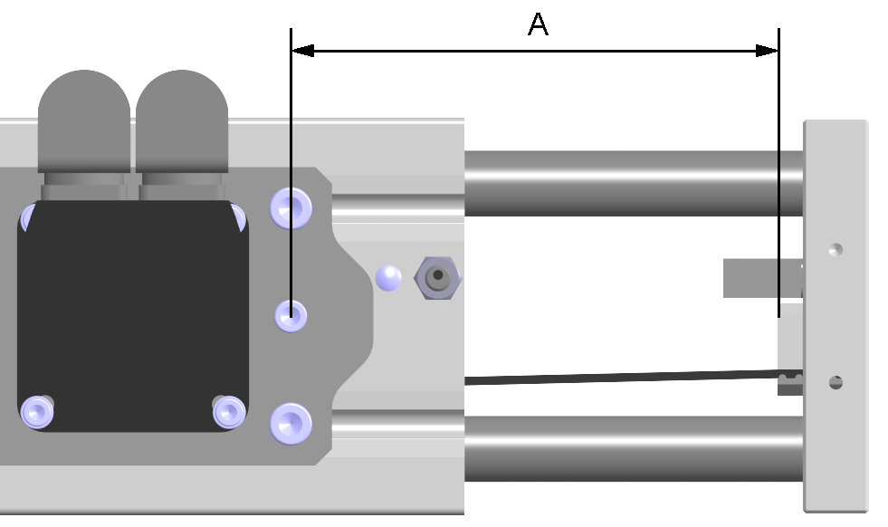

# Replacing the Toothed Belt

Replacing the Toothed Belt

Overview

Replacing the toothed belt can cause unintended movements.

|  |
| --- |
| Warning_Color.gifWARNING |
| UNINTENDED MOVEMENTS DUE TO DISMOUNTING |
| Secure the moving parts of the axis mounted in a vertical or tilted position against unintended movements. |
| Failure to follow these instructions can result in death, serious injury, or equipment damage. |

Prerequisites

You need the following tools to replace the toothed belt:

oSet of hex keys

oSoft-faced hammer

oTorque wrench with a set of hexagon sockets

oMedium strength securing adhesive

NOTE: Do not use ball head hex keys. Excessive torque may cause the ball head to tear off. A torn off ball head is difficult to remove from the screw.

To adjust the toothed belt tension, you need a:

oCaliper gauge (for distance measurement) or

oBelt tension meter (for vibration measurement)

For suitable parts, refer to [Replacement Equipment and Accessories](../ROBOTICS_Replacement_Equipment/ROBOTICS_Replacement_Equipment-3.htm#XREF_D_SE_0076671_1).

Distance and Vibration Measurement

For adjusting the toothed belt tension, you can use either distance measurement or vibration measurement:

oDistance measurement

The position of the toothed belt tensioner is measured with a caliper gauge. The position of the toothed belt tensioner is used to preload the toothed belt.

oVibration measurement

To restore the precise factory-adjusted toothed belt tension, use a belt tension meter for vibration measurement. The factory-adjusted toothed belt tension is presented in the following table. The measured preload values FV depend on the selectable measuring distance A and the weight of the respective toothed belt.

The measuring distance A is measured:

oFrom the outlet of the toothed belt at the toothed belt tensioner

oTo the middle of the next deflection pulley

| Description | Parameter | Unit | Value | | | |
| --- | --- | --- | --- | --- | --- | --- |
| CAR41 | CAR42 | CAR43 | CAR44 |
| Toothed belt type | – | – | T5 | AT5 | AT5 | AT5 |
| Width | – | mm (in) | 10 (0.39) | 20 (0.79) | 25 (0.98) | 32 (1.26) |
| Pitch | – | mm (in) | 5 (0.197) | 5 (0.197) | 5 (0.197) | 5 (0.197) |
| Weight | – | g/m (lb/ft) | 20 (0.0134) | 64 (0.043) | 80 (0.054) | 105 (0.07) |
| Toothed belt tension | Fv | N  (lbf) | 105…115  (23.6…26) | 325…360  (73…81) | 420…465  (94…105) | 525…580  (118…130) |

For any questions concerning the vibration measurement, contact your local Schneider Electric service representative.

Procedure Overview

Perform the following procedures to replace the toothed belt:

o[Preparing the replacement of the toothed belt](#XREF_D_SE_0067294_20)

o[Removing the toothed belt](#XREF_D_SE_0067294_10)

o[Cutting the new toothed belt to length](#XREF_D_SE_0067294_11)

o[Preparing the mounting of the toothed belt](#XREF_D_SE_0067294_21)

o[Mounting the toothed belt](#XREF_D_SE_0067294_18)

o[Mounting the toothed belt tensioners](#XREF_D_SE_0067294_12)

o[Testing movements](#XREF_D_SE_0067294_13)

Preparing the Replacement of the Toothed Belt

| Step | Action |
| --- | --- |
| 1 | If the axis is mounted tilted or vertically, remove the payload or support the payload and the end plates to keep it from falling. |

Removing the Toothed Belt

To remove the toothed belt, perform the tasks described below at both end plates.

| Step | Action |
| --- | --- |
| 1 | Move the axis body into the center position. |
| 2 | When using vibration measurement, proceed with step 3.  When using distance measurement, perform the following step:  Measure the position of the toothed belt tensioner (2) with a caliper gauge at both end plates (1) and note the values. The distance e has to be measured from the top of the toothed belt tensioner to the surface of the end plate.  G-SE-0057219.2.gif-high.gif |
| 3 | Remove the tensioning screws (3) and the toothed belt tensioners. Each toothed belt tensioner consists of a counter clamp (5) and a clamp profile (4).  G-SE-0057220.1.gif-high.gif      NOTE: Removing the toothed belt tensioners may require slight taps on the clamp profiles with a soft-faced hammer. |
| 4 | Remove the toothed belt (6).  G-SE-0057221.1.gif-high.gif      NOTE: If you want to replace the deflection pulleys only, omit the following step. |
| 5 | For CAR41: Remove the axis body adapter plate as described in [Removing the Toothed Belt Pulley](ROBOTICS_Maintenance_and_Repair-18.htm#XREF_D_SE_0067335_9).  For CAR42 / CAR43 / CAR44: [Remove the toothed belt pulley](ROBOTICS_Maintenance_and_Repair-18.htm#XREF_D_SE_0067335_9).  NOTE:  oFor an easier replacement of the toothed belt, dismount the motor and/or the gearbox.  oWhen replacing the toothed belt only, you do not have to remove the shaft extension. |

Cutting the New Toothed Belt to Length

| Step | Action |
| --- | --- |
| 1 | Place the new toothed belt (1) and the previous toothed belt (2) next to each other. Align the teeth with each other.  G-SE-0057211.2.gif-high.gif |
| 2 | Cut the new toothed belt to the same length as the previous toothed belt.  G-SE-0057212.2.gif-high.gif      NOTE: The number of teeth must be the same. |

Preparing the Mounting of the Toothed Belt

| Step | Action |
| --- | --- |
| 1 | Clean all parts. |
| 2 | Inspect all parts for damage. |

NOTE: Polluted or damaged parts may cause run-out which has an adverse effect on the service life of the axis.

|  |
| --- |
| NOTICE |
| UNINTENDED EQUIPMENT OPERATION |
| oReplace any damaged parts immediately.  oClean all parts before assembly and use. |
| Failure to follow these instructions can result in equipment damage. |

Mounting the Toothed Belt

| Step | Action |
| --- | --- |
| 1 | Insert the toothed belt (4) to the premounted toothed belt pulley (3) and deflection pulleys (2) at the axis body adapter plate (1). Verify the orientation of the teeth.  G-SE-0065035.1.gif-high.gif |
| 2 | Insert the axis body adapter plate, complete with the toothed belt, the toothed belt pulley, and the deflection pulleys carefully onto the axis body (5). Verify that the bearing bolts fit.  G-SE-0065036.1.gif-high.gif |
| 3 | Align the axis body adapter plate parallel to the axis body. Verify that there is no gap between the axis body adapter plate and the axis body so that the installation surface is in full contact with the mounting surface of the axis. |
| 4 | Mount the axis body adapter plate to the axis body with the four outer screws (6). Use the [standard tightening torque](../ROBOTICS_Transport_and_Comissioning/ROBOTICS_Transport_and_Comissioning-6.htm#XREF_D_SE_0088555_4).  G-SE-0065174.1.gif-high.gif |

| Step | Action |
| --- | --- |
| 1 | Insert the toothed belt (1). Verify the orientation of the teeth.  G-SE-0057231.2.gif-high.gif |
| 2 | Compress the toothed belt so that the toothed belt pulley can be inserted.  G-SE-0057232.2.gif-high.gif |
| 3 | Insert the toothed belt pulley (2) carefully into the axis body (3).  G-SE-0057233.2.gif-high.gif |
| 4 | Align the axis body adapter plate (4) parallel to the axis body. Verify that there is no gap between the axis body adapter plate and the axis body so that the installation surface is in full contact with the mounting surface of the axis.  G-SE-0065248.1.gif-high.gif |
| 5 | Mount the axis body adapter plate to the axis body with the four outer screws (5). Use the [standard tightening torque](../ROBOTICS_Transport_and_Comissioning/ROBOTICS_Transport_and_Comissioning-6.htm#XREF_D_SE_0088555_4). |
| 6 | Insert and tighten the two screws in the middle (6) to fasten the deflection pulleys. Use the [standard tightening torque](../ROBOTICS_Transport_and_Comissioning/ROBOTICS_Transport_and_Comissioning-6.htm#XREF_D_SE_0088555_4). |

Mounting the Toothed Belt Tensioners

| Step | Action |
| --- | --- |
| 1 | Insert the ends of the toothed belt (4) succinctly into the clamp profiles (3).  G-SE-0065065.2.gif-high.gif |
| 2 | Insert both clamp profiles and the counter clamps (5) into the end plates (2). |
| 3 | Apply a thin layer of medium strength securing adhesive on the tensioning screws (1) and insert the screws through the end plates into the toothed belt clamps. |
| 4 | Tension the toothed belt by adjusting the tensioning screws at both end plates. Use either distance or vibration measurement:  oWith distance measurement: tighten the tensioning screws with the values noted in [Removing the Toothed Belt](#XREF_D_SE_0067294_10).  oWith vibration measurement: alternate the tightening of the tensioning screws until the respective [toothed belt tension is reached](#XREF_D_SE_0067294_15). |
| 5 | If applicable, [mount the elastomer coupling](../ROBOTICS_Optional_Equipment/ROBOTICS_Optional_Equipment-4.htm#XREF_D_SE_0067152_7). |
| 6 | If applicable, [mount the motor and/or gearbox](../ROBOTICS_Optional_Equipment/ROBOTICS_Optional_Equipment-4.htm#XREF_D_SE_0067152_1). |

Testing Movements

| Step | Action |
| --- | --- |
| 1 | Run initial tests at reduced velocity. |
| 2 | Verify the toothed belt tension.  For details, refer to [Maintaining the Toothed Belt](ROBOTICS_Maintenance_and_Repair-5.htm#XREF_D_SE_0062299_1). |
| 3 | Mount the payload. |

EIO0000003043.01

© 2019 Schneider Electric. All rights reserved.