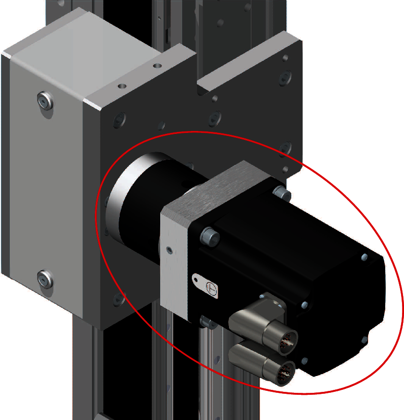
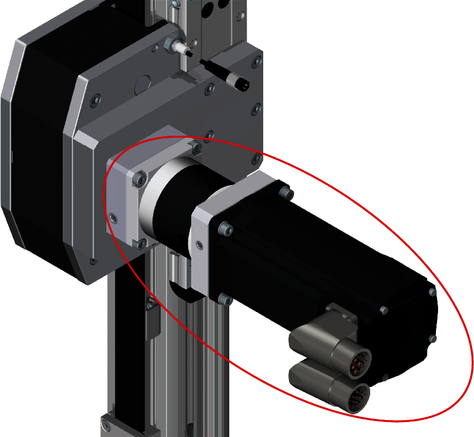
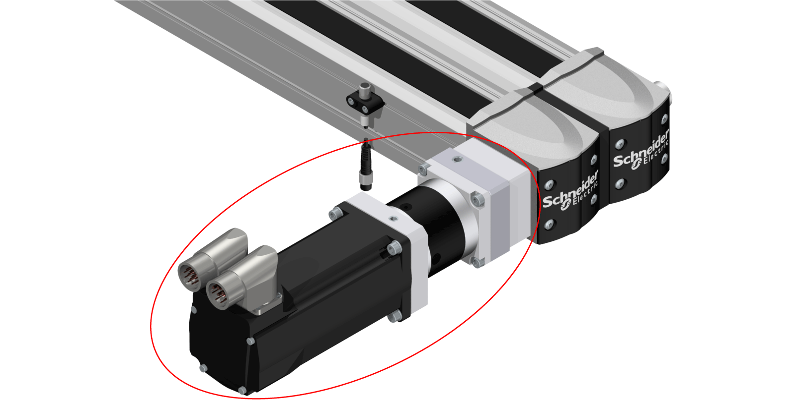
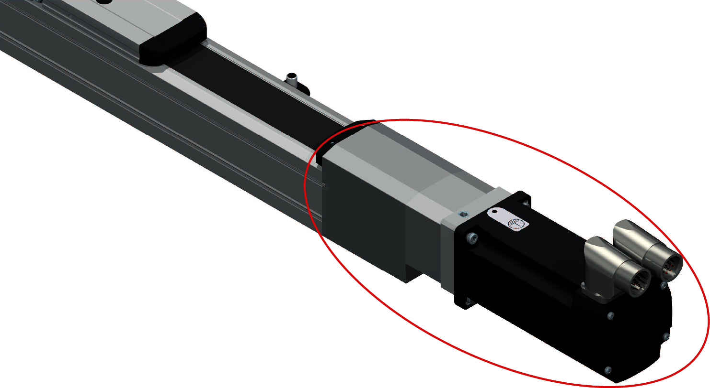

# Residual Risks

## Overview

Risks arising from the axis have been reduced. However a residual risk remains since the axis is moved and operated with electrical voltage and electrical currents.

If activities involve residual risks, a safety message is made at the appropriate points. This includes potential hazards that may arise, their possible consequences, and describes preventive measures to avoid the hazards.

## Electrical Parts

To animate the axis described herein, you must connect the axis motor to a drive. As a system, residual risks exist and you must account for them in your risk analysis of your application. For more information, consult your drive and motor documentation.

| DANGER | |
| --- | --- |
|  | ELECTRIC SHOCK, EXPLOSION, OR ARC FLASH  * Disconnect all power from all equipment including connected devices prior to removing any covers or doors, or installing or removing any accessories, hardware, cables, or wires except under the specific conditions specified in the appropriate hardware guide for this equipment. * Always use a properly rated voltage sensing device to confirm that the power is off where and when indicated. * Replace and secure all covers, accessories, hardware, cables, and wires and confirm that a proper ground connection exists before applying power to the equipment. * Use only the specified voltage when operating this equipment and any associated products. * After switching off the equipment make sure to maintain a waiting time of at least 15 minutes before disconnecting the power cable for the capacitors to discharge. * Operate electrical components only with a connected protective ground (earth) cable. * Verify the secure connection of the protective ground (earth) cable to the electrical devices so that connection complies with the wiring diagram. * Do not touch the electrical connection points of the components when the equipment is energized. * Provide protection against indirect contact. * Insulate any unused conductors on both ends of the connection cable. * Ensure that the power cables are correctly connected and connectors are locked in place during the operation time of the system.  Failure to follow these instructions will result in death or serious injury. |

## Emergency Stop

The axis is not supplied with external brakes nor an emergency stop switch to engage any external brakes. However, the motor can be supplied with an internal holding brake (as an option depending on the motor reference). For more information about the motor, record the motor reference on the type plate and refer to the corresponding motor manual.

Applying the holding brake while the motor shaft is rotating under power will cause excessive wear and loss of the braking force.

| WARNING | |
| --- | --- |
|  | LOSS OF BRAKING FORCE DUE TO WEAR OR HIGH TEMPERATURE  * Do not use the holding brake as a service brake. * Do not exceed the maximum number of brake applications and the kinetic energy during braking of moving loads.  Failure to follow these instructions can result in death, serious injury, or equipment damage. |

| WARNING | |
| --- | --- |
|  | ENTRAPMENT BY AXIS  * Provide means for ensuring that the motors can be put into a voltage-free state with any internal holding brake or external service brake released. * Make available those means to allow one person to manually move the axis within reach of the zone of operation.  Failure to follow these instructions can result in death, serious injury, or equipment damage. |

The opening of the motor holding brake may cause the axis to move.

Mounted in vertical or tilted position, the axis can move unexpectedly.

| WARNING | |
| --- | --- |
|  | MOVING PARTS OF THE EQUIPMENT  Ensure that releasing the brake poses no subsequent risks in the zone of operation.  Failure to follow these instructions can result in death, serious injury, or equipment damage. |

NOTE: Provide separation devices for all infeed energies. It must be possible to secure the separation devices in de-energized position, for example, by locking.

## Assembly and Handling

| WARNING | |
| --- | --- |
|  | CRUSHING, SHEARING, CUTTING AND HITTING DURING HANDLING  * Observe the general construction and safety regulations for handling and assembly. * Use appropriate mounting and transport equipment and use appropriate tools. * Prevent clamping and crushing by taking appropriate precautions. * Cover edges and angles to protect against cutting damage. * Wear suitable protective clothing (for example, protective goggles, protective boots, protective gloves).  Failure to follow these instructions can result in death, serious injury, or equipment damage. |

## Axis Motion

Parts of the axis can move at high speeds. In such cases, the payload weight, additionally installed tools, and shifts in the center of gravity of the moving parts contribute to the total energy of the forces generated.

Motion sequences can occur when operating with the axis, which could allow operational staff to make misjudgments. For safety considerations (according to EN ISO 13849-1), consider the controller and the brake as non-safety-related elements. Ensure that necessary protective measures are implemented.

The safety standards and directives for the respective country where the axis is in use define which protective measures are appropriate. Additionally, the system engineer who is responsible for the integration of the axis must evaluate which measures have to be taken.

NOTE: The configuration of the axis, the Tool Center Point (TCP) velocity, as well as the additional payload have an effect on the total energy, which can potentially be a source of damage and injury.

| WARNING | |
| --- | --- |
|  | CRUSHING, SHEARING, CUTTING AND IMPACT INJURY  * The axis must be operated only within an enclosure. * Open or enter the enclosure for cleaning and maintenance purposes only. * Design the enclosure to withstand an impact from the axis and to resist ejected parts from escaping the zone of operation. * Design the enclosure to safely deactivate the axis as soon as a person enters the zone of operation of the axis. * All barriers, protective doors, contact mats, light barriers, and other protective equipment, must be configured correctly and enabled whenever the axis is under power. * Define the clearance distance to the zone of operation of the axis so that operational staff do not have access to, nor can be enclosed in, the axis zone of operation. * Design the enclosure to account for the maximum possible travel paths of the axis; that is, the maximum path until the hardware safety system limits as well as the additional run-on paths, in case of a power interruption.  Failure to follow these instructions can result in death, serious injury, or equipment damage. |

| WARNING | |
| --- | --- |
|  | BREAKDOWN OF THE INTERNAL MOTOR HOLDING BRAKE  * Do not consider the internal motor holding brake to be a functional safety device. * Take into account a possible breakdown of the internal motor holding brake during your safety analysis.  Failure to follow these instructions can result in death, serious injury, or equipment damage. |

If the power supply of the control system becomes inoperable, the axis deviates from the specified movement in an uncontrolled manner whether the motor has a brake or not.

| WARNING | |
| --- | --- |
|  | DEVIATION FROM THE SPECIFIED MOVEMENT  Use an Uninterruptible Power Supply (UPS) in order to enable a controlled stop of the axis in accordance with stop category 1.  Failure to follow these instructions can result in death, serious injury, or equipment damage. |

## Hot Surfaces

The motor, the gearbox, and the adaptation materials of the axis may exceed 70 °C (158 °F) when subjected to heavy loads and/or high performance during operation.

The red circle in the following figure presents the hot surfaces of the axis.

| WARNING | |
| --- | --- |
|  | HOT SURFACES  * Avoid unprotected contact with hot surfaces. * Do not allow flammable or heat-sensitive parts in the immediate vicinity of hot surfaces. * Verify that the heat dissipation is sufficient by performing a test run under maximum load conditions.  Failure to follow these instructions can result in death, serious injury, or equipment damage. |

## Hazardous Movements

There can be different sources of hazardous movements:

* No or incorrect calibration of the drive
* Wiring or cabling errors
* Errors in the application program
* Component errors
* Error in the measured value and signal transmitter
* Incorrect installation settings (for example, payload parameter, TCP offset, safety-related configuration)
* Combination of the Lexium CAS2-Series with other equipment or integration into a machine or process

NOTE: Provide for personal safety by primary equipment monitoring or measures. Do not rely only on the internal monitoring of the drive components. Adapt the monitoring or other arrangements and measures to the specific conditions of the installation in accordance with a hazard and risk analysis.

| DANGER | |
| --- | --- |
|  | UNAVAILABLE OR INADEQUATE PROTECTION DEVICE(S)  * Prevent entry to a zone of operation with, for example, protective fencing, mesh guards, protective coverings, or light barriers. * Dimension the protective devices properly and do not remove or modify them. * Do not make any modifications that can degrade, incapacitate, or in any way invalidate protection devices. * Bring the drives and the motors they control to a stop before accessing the drives or entering the zone of operation. * Protect existing workstations and operating terminals against unauthorized operation. * Position emergency stop switches so that they are easily accessible and can be reached quickly. * Validate the functionality of emergency stop equipment before start-up and during maintenance periods. * Prevent unintentional start-up by disconnecting the power connection of the drives using the emergency stop circuit or using an appropriate lock-out tag-out sequence. * Validate the system and installation before the initial start-up. * Avoid operating high-frequency, remote control, and radio devices close to the system electronics and their feed lines. * Perform, if necessary, a special electromagnetic compatibility (EMC) verification of the system.  Failure to follow these instructions will result in death or serious injury. |

Drive systems may perform unanticipated movements because of incorrect wiring, incorrect settings, incorrect data, or other errors.

| WARNING | |
| --- | --- |
|  | UNINTENDED MOVEMENT OR MACHINE OPERATION  * Carefully install the wiring in accordance with EMC standards. * Do not operate the robot with undetermined settings and data. * Do not operate the axis with undetermined settings and data. * Do not operate the actuator with undetermined settings and data. * Perform comprehensive commissioning tests that include verification of configuration settings and data that determine position and movement. * Do not operate the axis with a payload greater than the maximum payload.  Failure to follow these instructions can result in death, serious injury, or equipment damage. |

## Noise Protection

The noise level of the axis depends on the basic cycle and the payload, as well as on further application-specific accessory parts. Be aware of the fact that noise emissions multiply when several axes are in use at the same time. If noise emissions reach a value of more than 70 dBA, wear hearing protection.

| CAUTION | |
| --- | --- |
|  | NOISE EMISSIONS OF THE AXIS  * Wear hearing protection in accordance with the locally applicable regulations. * Attach a sign on the axis if the noise emissions reach an excessive value.  Failure to follow these instructions can result in injury or equipment damage. |

NOTE: Attach the following symbol where it can easily be seen on the axis.

## Emissions

Some small amount of oil emissions are to be expected over time. However, excessive oil emissions on or at the gearbox may be an indication of a damaged axis.

| NOTICE | |
| --- | --- |
|  | INOPERABLE EQUIPMENT INDICATED BY GEARBOX LUBRICANT EMISSIONS  * Verify the mechanics before, during, and after use. * Shut down the mechanics immediately if lubricant emissions appear on the axis mechanics.  Failure to follow these instructions can result in equipment damage. |

## Hanging Loads

The axis is capable of suspending heavy loads.

| WARNING | |
| --- | --- |
|  | Falling Loads  * Do not stand under hanging loads. * Ensure that the axis is properly bolted on the mounting surface. * Ensure that the permissible payload is properly bolted on the axis tool flange.  Failure to follow these instructions can result in death, serious injury, or equipment damage. |

## Attachments or Modifications

If different customer end products are transported by the axis mechanics, then the product pickup must be modified accordingly. For this reason, you can mount different product pickups (tool mounting) onto the carriage. In doing so, ensure that the movement is not restricted and/or that no motion errors can result from the modifications. Attachments and rebuilds may not influence the operation of the protective devices in any way and all emergency stop buttons must be accessible and operational all the time.

If different customer end products are transported by the axis mechanics, then the product pickup must be modified accordingly. For this reason, you can mount different product pickups (tool mounting) to the carriage 2. In doing so, ensure that the movement is not restricted and/or that no motion errors can result from the modifications. Attachments and rebuilds may not influence the operation of the protective devices in any way and all emergency stop buttons must be accessible and operational all the time.

If different customer end products are transported by the axis mechanics, then the product pickup must be modified accordingly. For this reason, you can mount different product pickups (tool mounting) to the end plates or the axis profile. In doing so, ensure that the movement is not restricted and/or that no motion errors can result from the modifications. Attachments and rebuilds may not influence the operation of the protective devices in any way and all emergency stop buttons must be accessible and operational all the time.

| WARNING | |
| --- | --- |
|  | UNINTENDED EQUIPMENT OPERATION  * Do not drill into or modify the axis. * Do not modify the cable set. * Do not modify the components of movable mechanics.  Failure to follow these instructions can result in death, serious injury, or equipment damage. |

## Moving the Axis Without Drive Energy

The axis is not equipped with an enclosure (see UL 1740).

NOTE: Take appropriate security measures concerning the specific use before operating the axis.

| WARNING | |
| --- | --- |
|  | MOVING PARTS OF THE EQUIPMENT  Ensure that releasing the brake poses no subsequent risks in the zone of operation.  Failure to follow these instructions can result in death, serious injury, or equipment damage. |

If you have to move the end plates manually, perform the following steps:

If you have to move the carriages manually, perform the following steps:

If you have to move the carriage manually, perform the following steps:

| Step | Action |
| --- | --- |
| 1 | If the axis is mounted tilted or vertically, remove the payload or support the payload and the end plates to keep it from falling.  If the axis is mounted tilted or vertically, remove the payload or support the payload and the carriages to keep it from falling.  If the axis is mounted tilted or vertically, remove the payload or support the payload and the carriage to keep it from falling.  If the axis is mounted tilted or vertically, support the carriage 2 and the axis profile to keep it from falling. |
| 2 | Put the axis into a torque-free state. |
| 3 | Release the motor brake.  NOTE: The function for releasing the brake as well as for torque-free de-energizing of the motor is not controlled by the equipment delivered with the product reference, but must be addressed by the application. |
| 4 | Manually move the end plates.  Manually move the carriages.  Manually move the carriage.  NOTE: An appreciable amount of force could be necessary because the motor and gearbox may pose resistance to movement. |
| 5 | Engage the motor brake. |

EIO0000005662.00