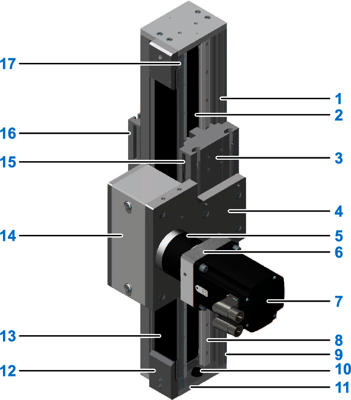
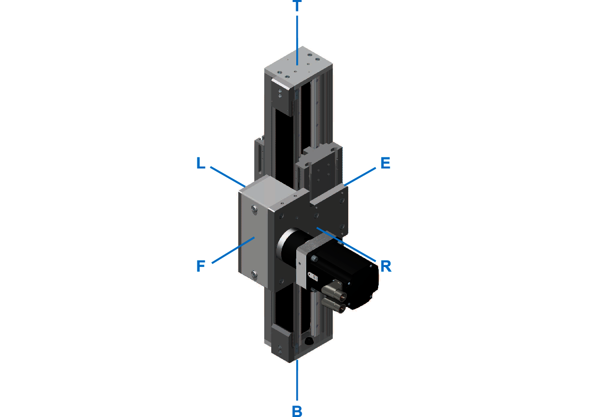

# Product Overview

## General Description of the Lexium CAS2-Series

The Lexium CAS2-Series is a ready-to-install telescopic axis with toothed belt drive and four linear guides with a telescopic carriage. In contrast to a linear axis, the drive block of the telescopic axis is fixed in place. The load is mounted on the moveable telescopic carriage, which in turn is located on the also moveable axis profile. Due to this design, the total length is shorter than the stroke (for strokes longer than 1 m), as the total length only increases by half the stroke. The telescopic axis is ideally suited for the transport of medium loads with medium strokes.

The Lexium CAS2-Series is equipped with recirculating ball bearing guides.

## Components Overview

The following figure presents the standard components of the different axis configurations.

|  |  |  |  |
| --- | --- | --- | --- |
| **1** | Axis profile | **10** | Rubber buffer |
| **2** | Inner toothed belt | **11** | End plate |
| **3** | Carriage 1 (fixed) with T-slots for mounting the axis | **12** | Toothed belt tensioner |
| **4** | Drive block including toothed belt pulley | **13** | Outer toothed belt |
| **5** | Gearbox | **14** | Drive block cover |
| **6** | Motor-to-gearbox adapter | **15** | Sensor with cable and connector (inside the carriage 1, optional equipment) |
| **7** | Motor | **16** | Carriage 2 (moveable) with T-slots for load mounting |
| **8** | Recirculating ball bearing guide (two per carriage) | **17** | Contact plate |
| **9** | End block including deflection pulley |  |  |

## View Definition

The following figure represents the definition of the views of the axis.

|  |  |
| --- | --- |
| **T** Top |  |
| **L** Left-hand side |  |
| **R** Right-hand side |  |
| **B** Bottom |  |
| **E** Rear |  |
| **F** Front |  |

EIO0000005662.00