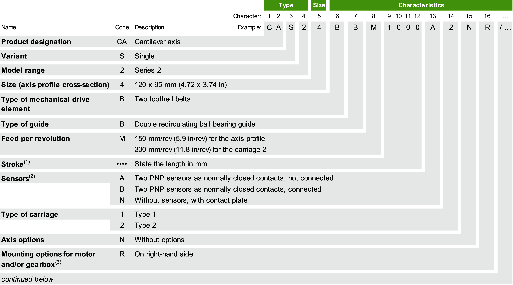
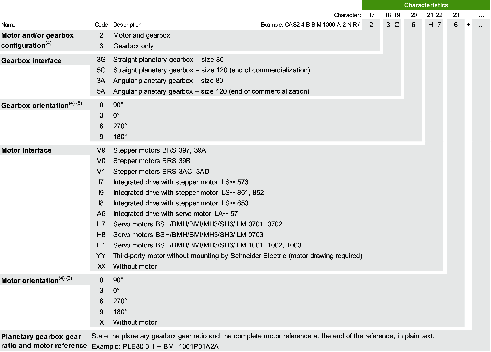
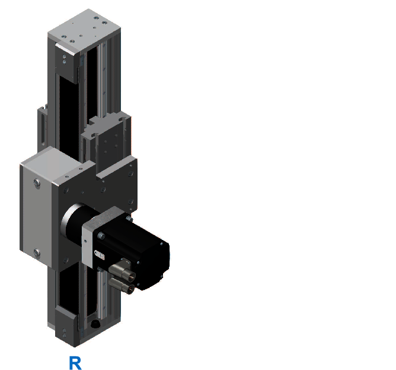
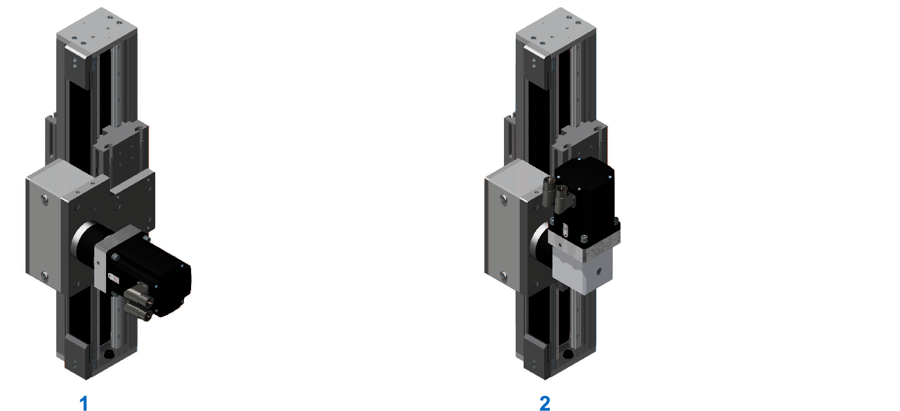
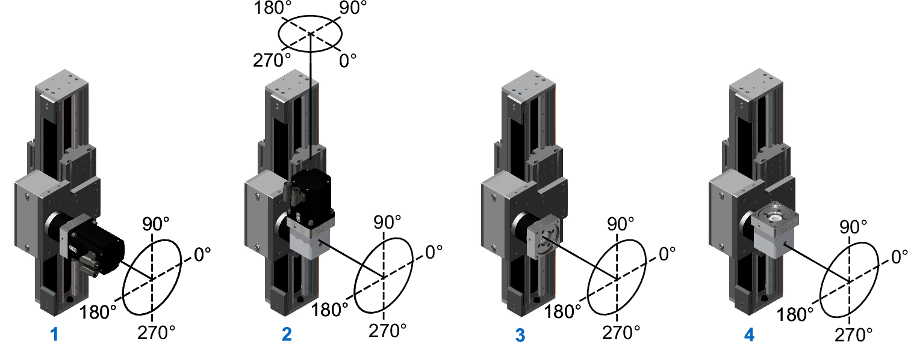

# Type Code

## Overview

To find the appropriate axis information, refer to the [type plate located on the axis](CAS2_TypePlate.html).

**(1)** For the minimum and maximum stroke per size, refer to the [mechanical data of the axis](D-SE-0088553.html#D-SE-0088553).

**(2)** Supplied with a 0.2 m (7.9 in) cable equipped with an M8 connector. For sensor extension cables, refer to [*Sensor Extension Cables*](CAS2_ReplacementEquipmentAndAccessoriesO.html#CAS2_ReplacementEquipmentAndAccessoriesO__D-SE-0106430.9).

**(3)** For further information, refer to [*Mounting Options for the Motor and/or the Gearbox*](#CAS2_CommercialReference__MountingOptionsForTheMotorAndorTheG-623F5A72).

**(4)** For further information, refer to [*Motor and/or Gearbox Orientation and Configuration*](#CAS2_CommercialReference__MotorAndorGearboxOrientationAndConf-623F5F8E).

**(5)** In case of a straight planetary gearbox, the orientation references to the setscrew of the drive unit adaptation.

**(6)** With reference to the motor connectors.

If you have questions concerning the type code, contact your local Schneider Electric representative.

## Types of Mechanical Drive Elements

The Lexium CAS2-Series is available with two toothed belts only. One toothed belt drives the carriage 2 and the other drives the axis profile. For a detailed name description of the Lexium CAS2-Series, refer to [*Type Code*](#CAS2_CommercialReference).

## Types of Linear Guides

The Lexium CAS2-Series is available with a double recirculating ball bearing guide only. For a detailed name description of the Lexium CAS2-Series, refer to [*Type Code*](#CAS2_CommercialReference).

## Mounting Options for the Motor and/or the Gearbox

The following graphic presents the mounting options for the motor and/or the gearbox for the Lexium CAS2-Series.

**R** On right-hand side

For a detailed name description of the Lexium CAS2-Series, refer to [*Type Code*](#CAS2_CommercialReference).

## Mounting Direction for Motor and Gearbox

The following graphic presents the possible mounting direction of the motor and gearbox combinations. The gearbox is coupled to the axis with a shrink disc.

**1** Straight mounted

**2** Mounted with angle gearbox, rotatable 4 x 90°

## Motor and/or Gearbox Orientation and Configuration

The following graphics represent the possible motor and/or gearbox orientation and configuration for the Lexium CAS2-Series.

**1** CAS24BBM••••••NR/2•G••••

**2** CAS24BBM••••••NR/2•A••••

**3** CAS24BBM••••••NR/3•G•••X

**4** CAS24BBM••••••NR/3•A•••X

For a detailed name description of the Lexium CAS2-Series, refer to [*Type Code*](CAS2_CommercialReference.html).

## Designation of Customized Version

In the case of a customized version, the type code contains one or several dollar signs "$". Example: CAS24BBM1000A$NR/2 3G 6 H7 6

If you have questions concerning customized versions, contact your local Schneider Electric service representative.

EIO0000005662.00