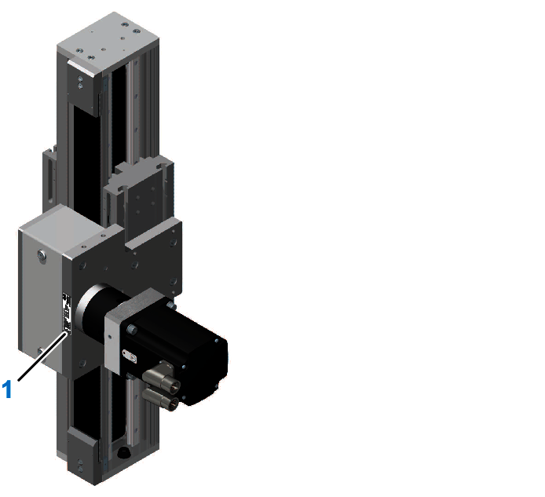

# Type Plate

## Position of the Type Plate

**1** Type plate

NOTE: Ensure that the type plate is accessible after installation.

## Description of the Type Plate

|  |  |
| --- | --- |
| The type plate contains the following data: | |
| **1** Product name\* | **9** Maximum drive torque |
| **2** Gearbox type | **10** Country of origin |
| **3** Serial number | **11** Production site |
| **4** Product order number | **12** Schneider Electric logo |
| **5** Identification number | **13** RoHS mark |
| **6** Motor type | **14** Data matrix code |
| **7** Date of manufacture | **15** Hardware version |
| **8** Weight of the axis |  |
| \* For detailed information about the meaning of the particular digits, refer to [*Type Code*](#CAS2_TypePlate). | |

EIO0000005662.00