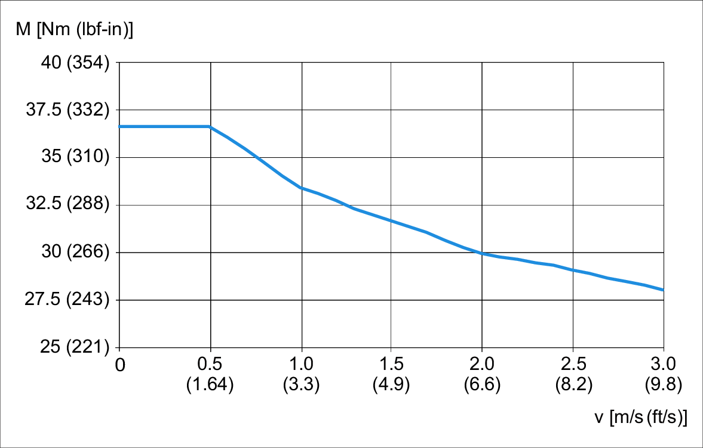
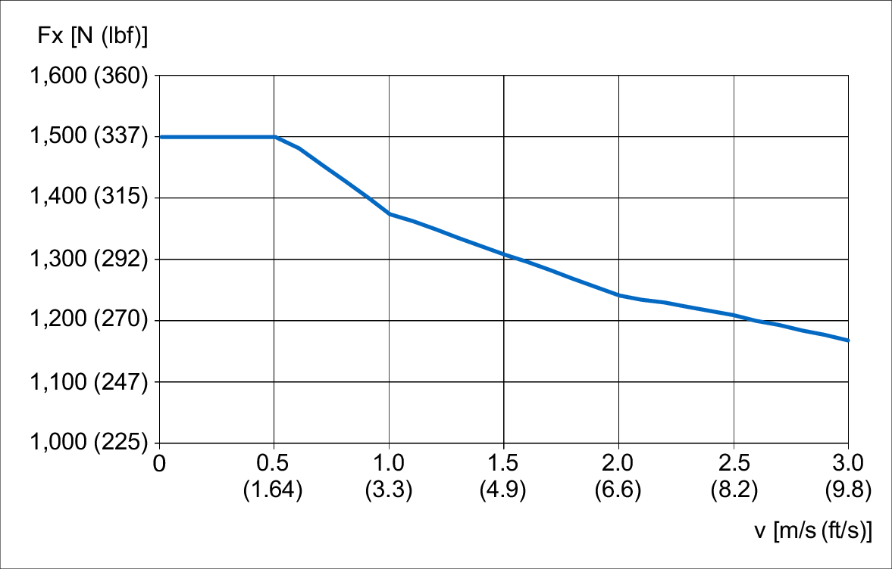
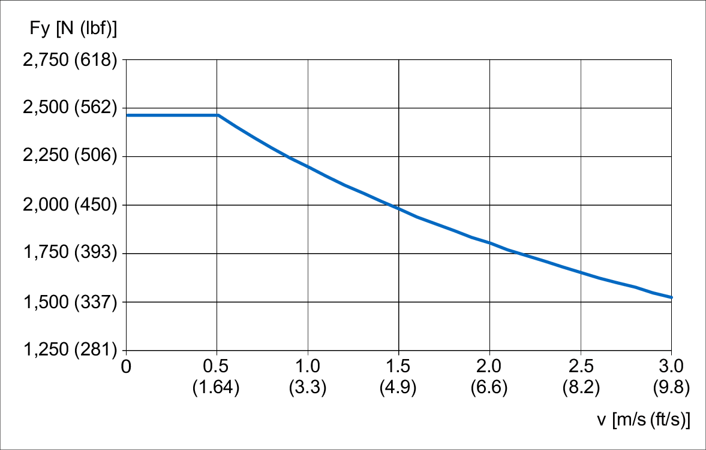
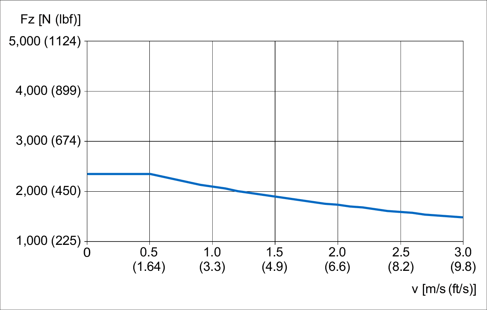
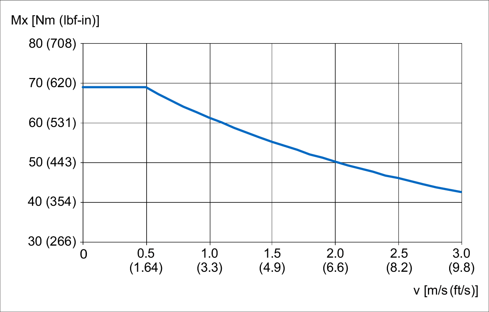
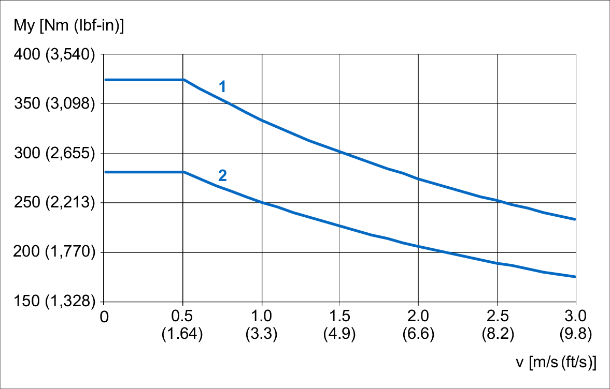
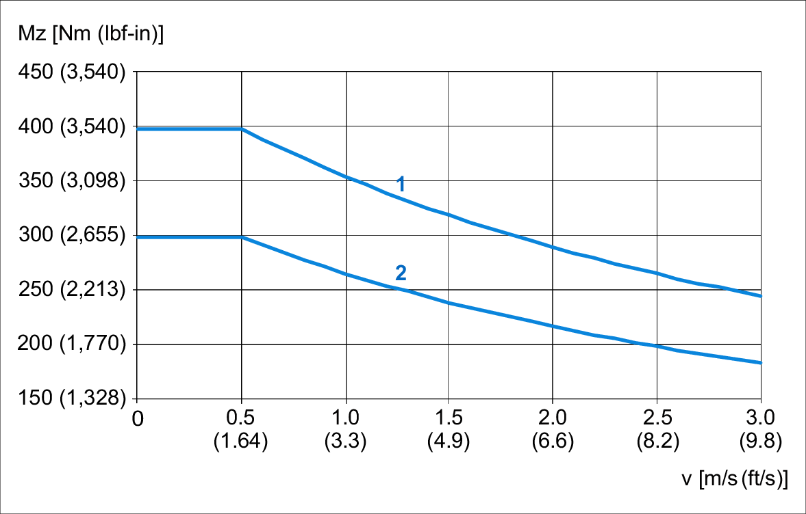
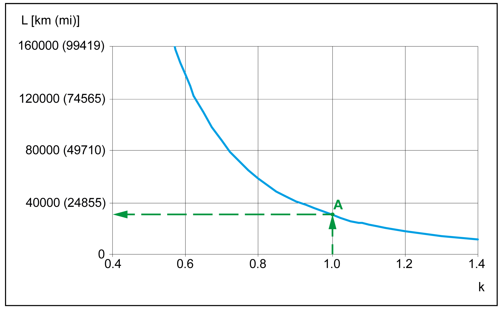

# Characteristic Curves for Lexium CAS24BB

## Maximum drive torque Mmax

## Maximum feed force Fx

## Maximum force Fy

## Maximum force Fz

## Maximum force Mx

## Maximum force My

**1** Carriage type 1

**2** Carriage type 2

## Maximum force Mz

**1** Carriage type 1

**2** Carriage type 2

## Service life

**A** The forces and torques (Fy, Fz, Mx, Mz, My) are calculated for an expected service life of 15,000 km (9,321 mi)30,000 km (18,641 mi)10,000 km (6,214 mi). This is shown with k factor equal 1.0 in the figure.

EIO0000005662.00