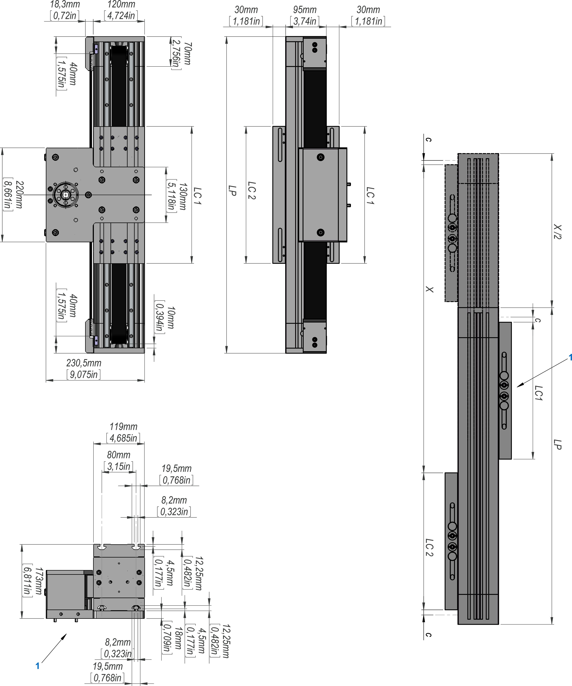

# Dimensional Drawing of Lexium CAS24

**1** Mechanical drive interface

| Parameter | Description | Unit | Value for Lexium CAS24 | |
| --- | --- | --- | --- | --- |
| Carriage type 1 | Carriage type 2 |
| Total length of portal axis | LP | mm  (in) | 380 + X  (15 + X) | 460 + X/2  (18 + X) |
| Stroke | X | – | See technical data | |
| Carriage length | LC1 and LC2 | mm  (in) | 320  (12.6) | 400  (15.7) |
| Stroke reserve up to mechanical stop | c | mm  (in) | 10  (0.39) | |

EIO0000005662.00