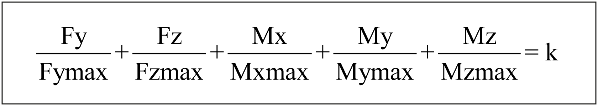
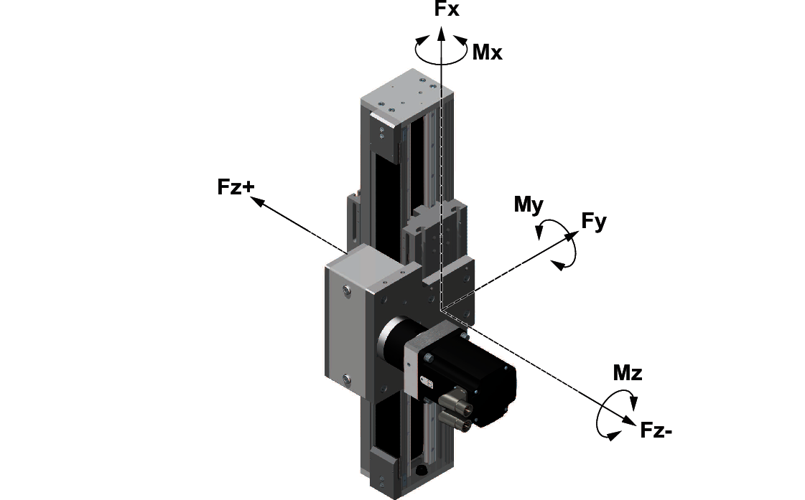
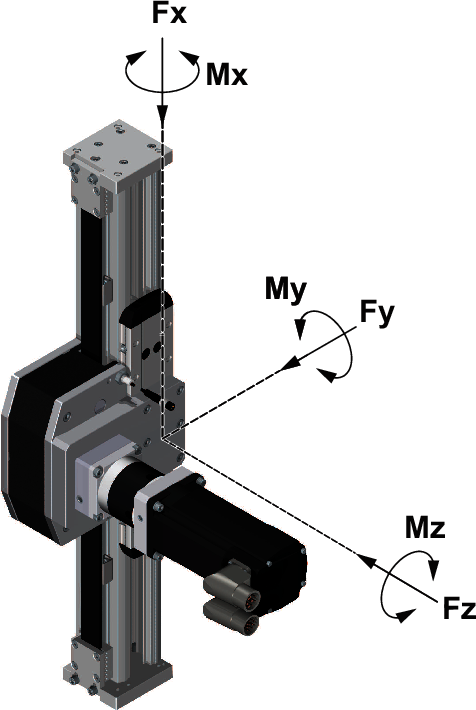
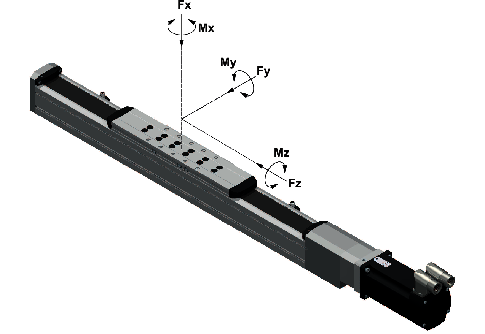
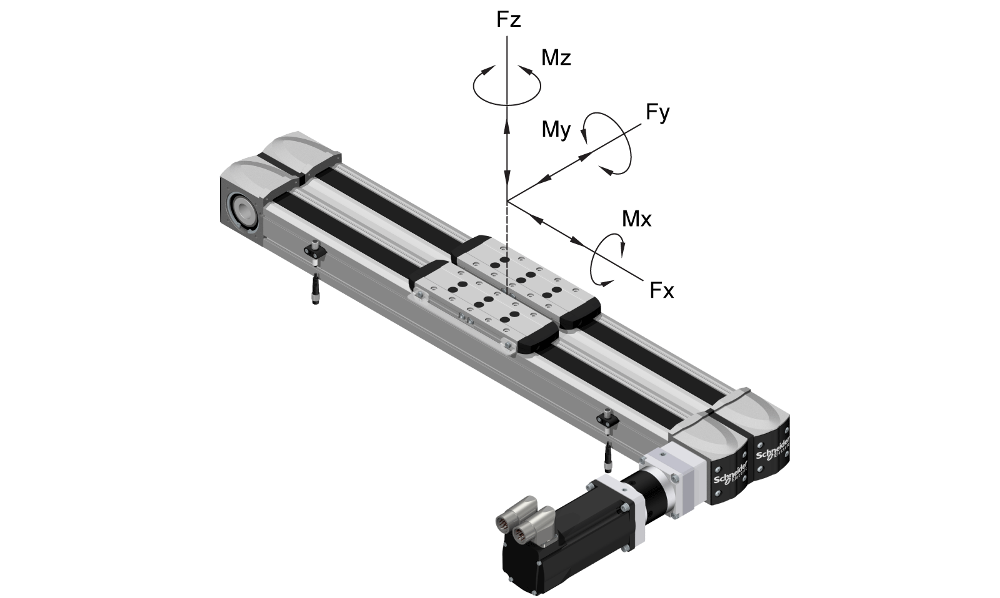

# Service Life

## Presentation

The service life of the linear guide of the axis is a function of the mean forces and torques that act in the system. If they act simultaneously, the load factor k can be calculated with the following formula:

The application-specific load values are entered in the numerator.

The denominator contains the maximum forces and torques of the axis. These forces and torques decrease at increasing velocities. For more information, refer to the respective characteristic curves of the forces and torques for the axis in [*Mechanical Data*](D-SE-0088553.html#D-SE-0088553).

The following figure presents the acting forces and torques on the axis.

The service life of the axis can be approximated by using the respective service life characteristic curve and the load factor k. Refer to [*Mechanical Data*](D-SE-0088553.html#D-SE-0088553) for the respective characteristic curve.

EIO0000005662.00