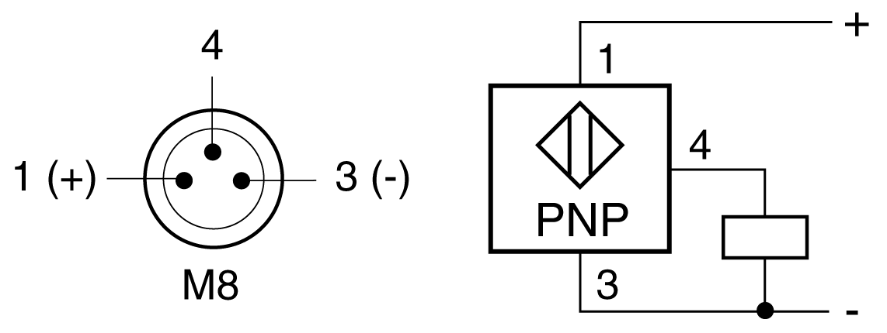

# Technical Data of the Sensors

## Technical Data of the Sensors

| Parameter | Unit | Description |
| --- | --- | --- |
| Dimensions | mm (in) | Square 40 x 8 x 8 (1.57 x 0.135 x 0.135) |
| Actuation type | – | Inductive |
| Certification | – | CE |
| Electrical connection (Polyurethane cable with M8 connector) | mm (in) | 200 (7.9) |
| Nominal switching distance sn (in the case of aluminum) | mm (in) | 2 (0.079) |
| Hysteresis | – | 1 to 15% of the real switching distance |
| Degree of protection as per IEC 60529 | – | IP67 |
| Temperature for storage | °C (°F) | -40…+85 (-40…+185) |
| Temperature for operation | °C (°F) | -25…+70 (-13…+158) |
| Housing material | – | Zinc, die-casting |
| Cable material | – | PUR, 3 x 0.14 mm2 |
| Function indicator output | – | LED |
| Function indicator supply voltage | – | No |
| Supply voltage (PELV) | Vdc | 12…24 with reverse polarity protection |
| Supply voltage (including residual ripple) | Vdc | 10…36 |
| Switching current (overload and short-circuit protection) | mA | < 200 |
| Voltage drop, output conducting | V | < 2 |
| No-load current | mA | < 10 |
| Maximum switching frequency | Hz | 5,000 |
| Switch-on time | ms | < 0.1 |
| Switch-off time | ms | < 0.1 |

## Connection Details of the Sensors

The optional sensors are equipped with an M8 connector. The following graphic presents the connection assignment of the sensors.

| Pin | Description | Color |
| --- | --- | --- |
| 1 | PELV supply voltage (+) | BN (brown) |
| 3 | PELV supply voltage (-) | BU (blue) |
| 4 | Output | BK (black) |

The cable length is 200 mm (7.9 in). For suitable extension cables with various lengths, refer to [*Replacement Equipment and Accessories*](CAS2_ReplacementEquipmentAndAccessoriesO.html).

EIO0000005662.00