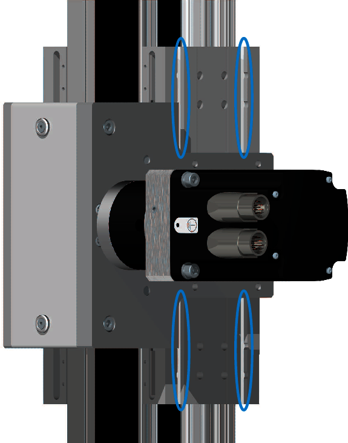

# Mounting the Axis

## Overview

A mounting surface with T-slots is located at the carriage 1 for mounting the axis.

NOTE: Fasten the axis with minimum two screws (M8 of property class 8.8 or greater) per T-slot. For more information, refer to the [dimensional drawing](D-SE-0100279.html).

For information about appropriate T-slot nuts, refer to [*Replacement Equipment and Accessories*](D-SE-0065517.html#D-SE-0065517).

| WARNING | |
| --- | --- |
|  | GREAT MASS OR FALLING PARTS  * Use a suitable crane or other suitable lifting gear to lift the axis if this is required by the mass of the axis. * Use the necessary personal protective equipment (for example, safety shoes, safety glasses and protective gloves). * Mount the axis in such a way (tightening torque, securing screws) that parts cannot come loose, even in the case of shocks and vibrations. * Take all necessary measures to avoid unanticipated movements of the axis mounted in vertical or tilted positions.  Failure to follow these instructions can result in death, serious injury, or equipment damage. |

| NOTICE | |
| --- | --- |
|  | INCORRECT INSTALLATION  * Inspect the cross section and size of the motor and gearbox as they must be free, and must not interfere with the installation surface. * If necessary, cut out the mounting surface as required to ensure the freedom of the motor and gearbox. * Do not mount the axis at the end plates. * Do not mount the axis at the end blocks. * Do not mount the axis at the end plate and the drive block.  Failure to follow these instructions can result in equipment damage. |

## Running Accuracy

The length of the axis can have an impact on the running accuracy. A long axis may bend, which can cause a reduced running accuracy. When mounting the axis, ensure that there is no gap between the carriage 1 and the installation surface so that the installation surface is in full contact with the mounting surface of the axis.

## Dimensions for Mounting

The following table presents the installation parameters for mounting the axis to the installation surface:

| Description | Unit | Value |
| --- | --- | --- |
| CAS24 |
| T-slot size | – | 8 |
| Total depth of the T-slot | mm (in) | 12 (0.47) |

NOTE: For more information, refer to the [dimensional drawing](D-SE-0100279.html).

## Prerequisites

You need the following tools to mount the axis:

* Set of hex keys
* Torque wrench with a set of hexagon sockets
* Dial gauge

NOTE: Do not use ball head hex keys. Excessive torque may cause the ball head to break away.

For suitable parts, refer to [*Replacement Equipment and Accessories*](D-SE-0065517.html#D-SE-0065517).

## Mounting the Axis

NOTE: When mounting the axis, keep in mind that it needs to be accessible for maintenance.

| Step | Action |
| --- | --- |
| 1 | Ensure that the planarity of the installation surface does not exceed 0.1 mm/m (0.0012 in/ft). |
| 2 | Insert and position the T-slot nuts into the carriage 1. |
| 3 | Carefully position the axis on its installation surface. |
| 4 | Tighten the fastening screws with a low tightening torque. |
| 5 | Place a dial gauge onto the carriage 2. |
| 6 | Move the carriage 2 and record the deviation regarding the reference plane over the entire stroke. |
| 7 | Correct the deviations by lateral alignment of the axis and by tightening the screws appropriately.  NOTE: Tightening torque: 21 Nm (186 lbf-in) for M8. |

EIO0000005662.00