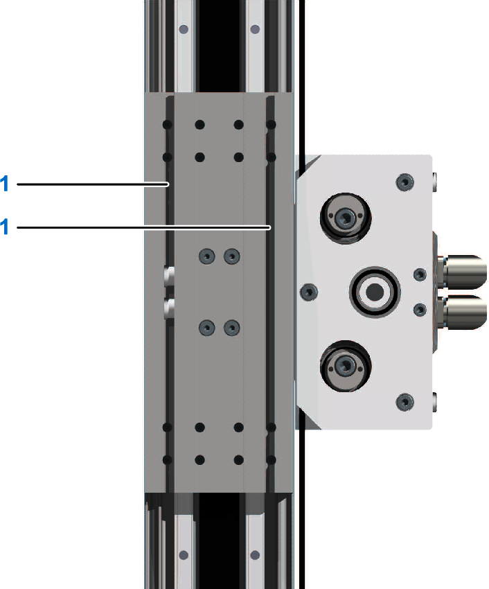

# Mounting the Payload

## Overview

To fasten the payload, T-slots are provided at the carriage 2.

**1** T-slots

NOTE:

* Fasten the payload with a sufficient amount of screws, appropriate dimensions, and a property class according to your application. For a section view of the carriage, refer to the [dimensional drawing](D-SE-0100279.html).
* Clean the mounting surfaces on the carriage and on the load.
* Tighten the screws crosswise.
* Verify the freedom of movement of the whole stroke.

For suitable parts, refer to [*Replacement Equipment and Accessories*](D-SE-0065517.html#D-SE-0065517).

## Dimensions for Mounting

The following table presents the dimensions for mounting the payload to the carriage 2:

| Description | Unit | Value |
| --- | --- | --- |
| CAS24 |
| T-slot size | – | 8 |
| Total depth of the T-slot | mm (in) | 12 (0.47) |

NOTE: For more information, refer to the [dimensional drawing](D-SE-0100279.html).

EIO0000005662.00