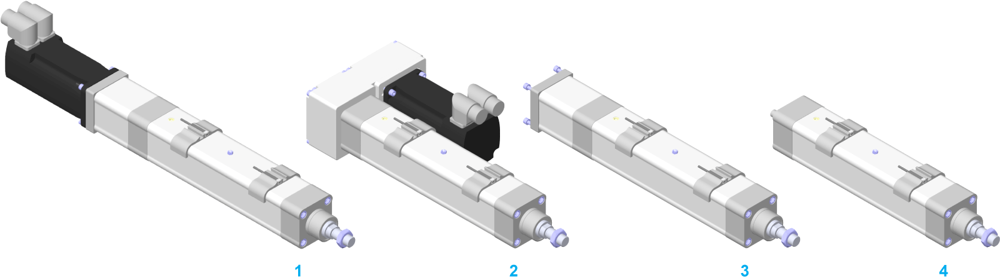

# Mounting Options for the Motor and/or the Belt Drive

Mounting Options for the Motor and/or the Belt Drive

The following figure presents the mounting options for the motor and/or the belt drive for the Lexium EAC1-Series.

1   Straight mounted motor

2   Mounted belt drive and mounted motor

3   Mounted adaptation material (coupling housing including elastomer coupling and motor adaptation)

4   Without motor and without belt drive (with shaft extension)