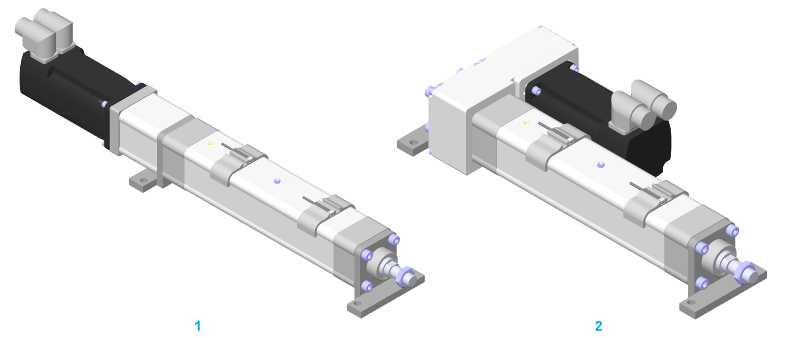

# Mounting Options for the Mounting Brackets

Mounting Options for the Mounting Brackets

The following figure presents the mounting options for the mounting brackets of the Lexium EAC1-Series.

1   Straight mounted motor and mounted mounting brackets

2   Mounted motor driven by belt drive and mounted mounting brackets