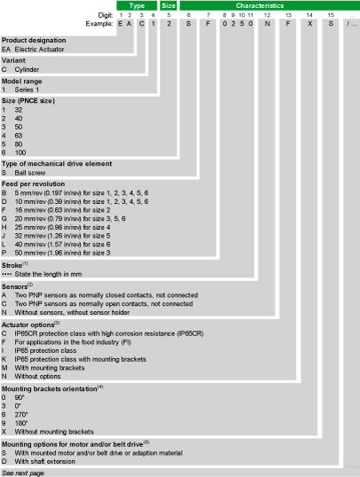

# Overview

Overview

To find the appropriate actuator information, refer to the [type plate](ROBOTICS_System_Overview-5.htm#XREF_D_SE_0081310_1) located on the actuator.

(1) For the maximum stroke per size, refer to catalog [Unimotion PNCE Electric Cylinder](../front/front-4.htm#XREF_D_SE_0081290_18) .

(2) Cable length: 300 mm (11.8 in); connector at one cable end. Extension cables are available as accessories.

(3) Mounting brackets are not available for option C and F.

(4) For further information, refer to [Mounting Brackets Orientation](#XREF_D_SE_0081309_5).

(5) For further information, refer to [Mounting Options and Direction for Motor](ROBOTICS_System_Overview-3.htm#XREF_D_SE_0081293_16).

(6) For further information, refer to [Motor and/or Belt Drive Orientation and Configuration](#XREF_D_SE_0081309_4).

If you have questions concerning the type code, contact your local Schneider Electric service representative.