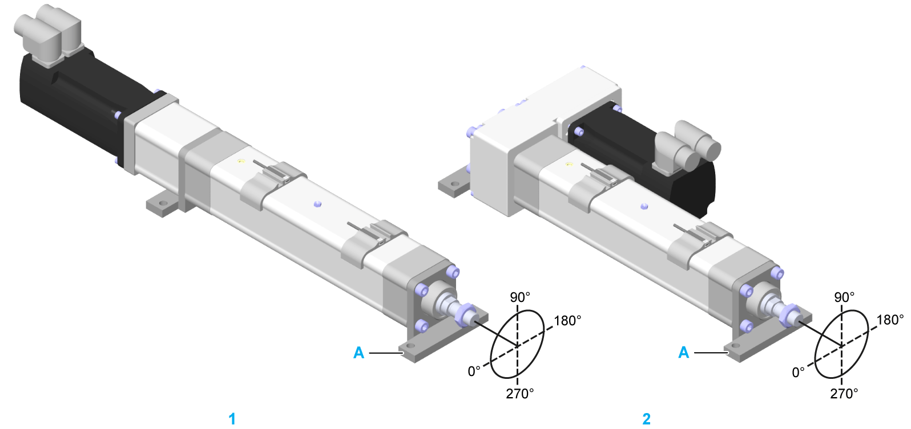

# Mounting Brackets Orientation

Mounting Brackets Orientation

The following graphic presents the possible mounting brackets orientation for the Lexium EAC1• electric actuator.

The coordinate system refers to the input side of the Lexium EAC1• and indicates the orientation of the mounting brackets, which can be mounted in maximum four orientations (0°, 90°, 180° and 270°) with reference to the mounting side (A).

A   Mounting side

1   EAC1••••••••M6S/1XX•••

2   EAC1••••••••M6S/2•L•••

For a detailed name description of the Lexium EAC1• series, refer to [Type Code](#XREF_D_SE_0081309_1).