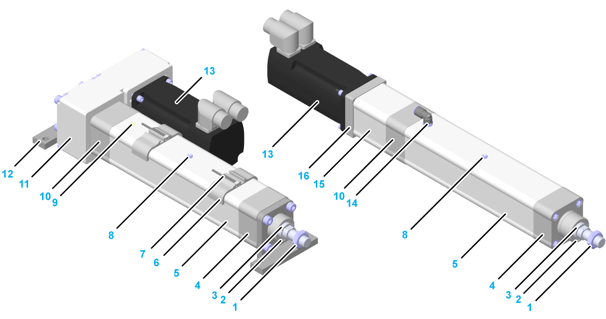
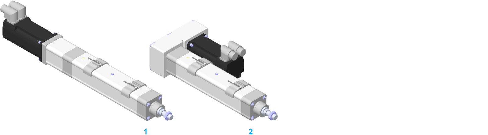

# Product Overview

Product Overview

General Description of the Lexium EAC1-Series

The Lexium EAC1-Series is an electric actuator which can operate forward and backward in one dimension. The actuator is based on the standard ISO 15552, and is driven by a precision ball screw. The outer design and the dimensions of the Lexium EAC1-Series are very similar to pneumatic cylinders.

Components Overview

|  |  |
| --- | --- |
| Lexium EAC1-Series with mounting brackets,  driven by belt drive | Lexium EAC1-Series with option C or F,  driven directly |

|  |  |
| --- | --- |
| 1 Hex nut  2 Piston rod seal  3 Piston rod (stainless steel) with an anti-rotation device  4 Front cap  5 Actuator profile  6 Sensor holders (optional equipment)  7 Sensors (optional equipment)  8 Lubrication nipple  9 Pressure compensation | 10 Drive cap  11 Belt drive (optional equipment, including clamping set)  12 Mounting brackets (optional equipment)  13 Motor (optional equipment)  14 Connections for pressure compensation (options C and F)  15 Coupling housing including elastomer coupling (optional equipment)  16 Motor adaptation (optional equipment) |

Characteristics of the Lexium EAC1-Series

The actuator provides the following features and options:

oHigh speeds

oGood positioning accuracy

oHigh repeatability

oDifferent stroke lengths available

oReduced backlash

oMotor mounting via compact coupling systems

oFastening thread at the end of the piston rod for mounting the payload or piston rod accessories

oSuitable lubricant for food and beverage applications

oSensors as normally open contacts / normally closed contacts as PNP version

oDifferent motors

oTwo motor mounting positions: [axial or on the side mounting](#XREF_D_SE_0081293_13)

Mounting Options for the Motor and/or the Belt Drive

The following figure presents the mounting options for the motor and/or the belt drive for the Lexium EAC1-Series.

1   Straight mounted motor

2   Mounted belt drive and mounted motor

3   Mounted adaptation material (coupling housing including elastomer coupling and motor adaptation)

4   Without motor and without belt drive (with shaft extension)

Mounting Directions of the Motor and/or the Belt Drive

The following figure presents the mounting directions for the motor and/or belt drive. The motor is coupled by using a preloaded elastomer coupling and the belt drive is coupled by using a coupling set.

1   Straight mounted

2   Mounted with belt drive, rotatable 4 x 90°

Mounting Options for the Mounting Brackets

The following figure presents the mounting options for the mounting brackets of the Lexium EAC1-Series.

1   Straight mounted motor and mounted mounting brackets

2   Mounted motor driven by belt drive and mounted mounting brackets

EIO0000003411.01

© 2019 Schneider Electric. All rights reserved.