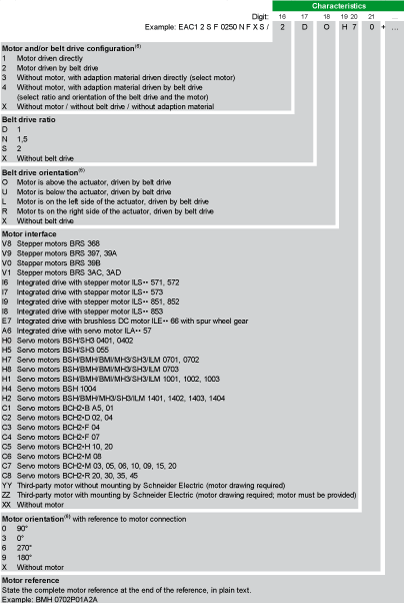
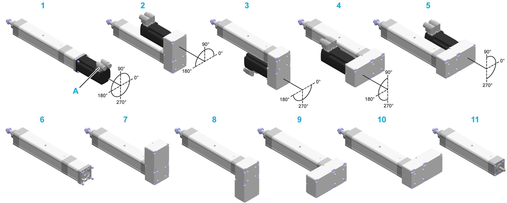

# Type Code

Type Code

Overview

To find the appropriate actuator information, refer to the [type plate](ROBOTICS_System_Overview-5.htm#XREF_D_SE_0081310_1) located on the actuator.

(1) For the maximum stroke per size, refer to catalog [Unimotion PNCE Electric Cylinder](../front/front-4.htm#XREF_D_SE_0081290_18) .

(2) Cable length: 300 mm (11.8 in); connector at one cable end. Extension cables are available as accessories.

(3) Mounting brackets are not available for option C and F.

(4) For further information, refer to [Mounting Brackets Orientation](#XREF_D_SE_0081309_5).

(5) For further information, refer to [Mounting Options and Direction for Motor](ROBOTICS_System_Overview-3.htm#XREF_D_SE_0081293_16).

(6) For further information, refer to [Motor and/or Belt Drive Orientation and Configuration](#XREF_D_SE_0081309_4).

If you have questions concerning the type code, contact your local Schneider Electric service representative.

Mounting Brackets Orientation

The following graphic presents the possible mounting brackets orientation for the Lexium EAC1• electric actuator.

The coordinate system refers to the input side of the Lexium EAC1• and indicates the orientation of the mounting brackets, which can be mounted in maximum four orientations (0°, 90°, 180° and 270°) with reference to the mounting side (A).

A   Mounting side

1   EAC1••••••••M6S/1XX•••

2   EAC1••••••••M6S/2•L•••

For a detailed name description of the Lexium EAC1• series, refer to [Type Code](#XREF_D_SE_0081309_1).

Motor and/or Belt Drive Orientation and Configuration

The following graphic presents the possible motor and/or belt drive orientation and configuration for the Lexium EAC1• electric actuator.

The coordinate system refers to the input side of the Lexium EAC1• and indicates the orientation of the motor, which can be mounted in maximum four orientations (0°, 90°, 180° and 270°) with reference to the motor connection (A).

|  |  |
| --- | --- |
| 1 EAC1••••••••••S/1XX•••  2 EAC1••••••••••S/2•O•••  3 EAC1••••••••••S/2•U•••  4 EAC1••••••••••S/2•L•••  5 EAC1••••••••••S/2•R••• | 6 EAC1••••••••••S/3XX••X  7 EAC1••••••••••S/4•O••X  8 EAC1••••••••••S/4•U••X  9 EAC1••••••••••S/4•L••X  10 EAC1••••••••••S/4•R••X  11 EAC1••••••••••D/XXXXXX |

For a detailed name description of the Lexium EAC1• series, refer to [Type Code](#XREF_D_SE_0081309_1).

Designation of Customized Version

In the case of a customized version, the type code contains one or several dollar signs "$". Example: EAC12SF0250$FXS/2D0H70

If you have questions concerning customized versions, contact your local Schneider Electric service representative.

EIO0000003411.01

© 2019 Schneider Electric. All rights reserved.