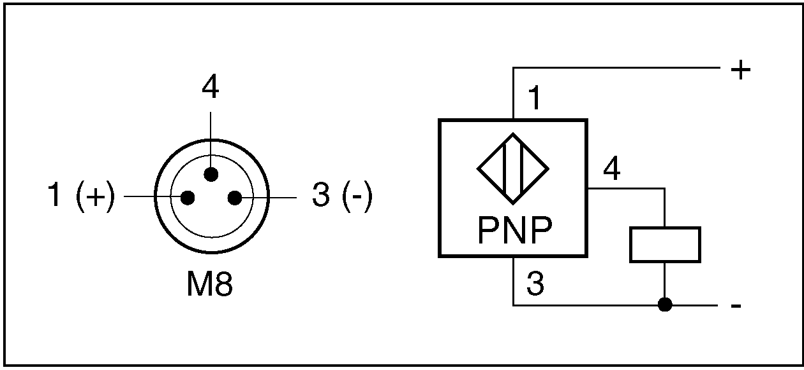

# Technical Data of the Sensors

Technical Data of the Sensors

Technical Data of the Sensors

For detailed technical data of the sensors, refer to the catalog [Unimotion PNCE Electric Cylinder](../front/front-4.htm#XREF_D_SE_0081290_18) .

Connection Details of the Sensors

The optional sensors are equipped with an M8 x 1 connector. The following figure presents the connection assignment of the sensors.

| Pin | Description |
| --- | --- |
| 1 | PELV supply voltage (+) |
| 3 | PELV supply voltage (-) |
| 4 | Output |

The maximum cable length is 300 mm (11.8 in). For suitable extension cables with various lengths, refer to [Replacement Equipment of the Lexium EAC1-Series](../ROBOTICS_Replacement_Equipment/ROBOTICS_Replacement_Equipment-3.htm#XREF_D_SE_0081355_1).

EIO0000003411.01

© 2019 Schneider Electric. All rights reserved.