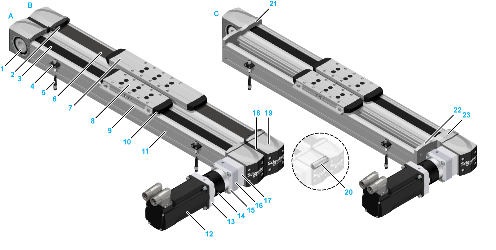

# Components Overview

Components Overview

The following figure presents the standard components of the different axis configurations.

|  |  |
| --- | --- |
| A PAD42BB or PAD42EB without cover strip  B PAD42BB or PAD42EB with cover strip\*  C PAD42PB without cover strip  \* When the cover strip is selected as optional equipment, both sides of the axis body are equipped with a cover strip. | |
| 1 Toothed belt pulley  2 Cover strip clamp (optional equipment)  3 Toothed belt  4 Sensor holder (optional equipment)  5 [Sensor](../glossary/glossary.htm#XREF_D_SE_0058496_37) with cable and connector (optional equipment)  6 Cover strip (optional equipment)  7 Strip deflector (optional equipment)  8 Carriage  9 Contact plate (optional equipment)  10 Rubber buffer  11 Axis body  12 Motor (optional equipment) | 13 Motor/gearbox adaptation (optional equipment)  14 Gearbox (optional equipment)  15 Flange plate (optional equipment)  15 Drive unit adaptation (optional equipment)  16 Coupling housing including coupling (optional equipment)  17 End block mid-plate (only PAD42BB and PAD42EB)  18 End block  19 Double coupling (only PAD42BB)  20 End plate 1 (only PAD42PB)  21 End plate 2 (only PAD42PB)  22 Distance plate (only PAD42PB) |