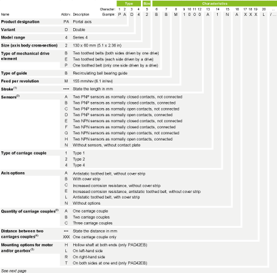

# Overview

Overview

To find the appropriate axis information, refer to the [type plate located on the axis](#XREF_D_SE_0104489_1).

(1) For the minimum and maximum stroke per size, refer to the [mechanical data of the axis](../ROBOTICS_Technical_Data/ROBOTICS_Technical_Data-3.htm#XREF_D_SE_0088553_1).

(2) Supplied with a 0.1 m (3.9 in) cable and equipped with an M8 connector. For sensor extension cables, refer to [Sensor Extension Cables](../ROBOTICS_Replacement_Equipment/ROBOTICS_Replacement_Equipment-3.htm#XREF_D_SE_0106430_9).

(3) Only carriage couples of the same type can be used. For more carriage couples, contact your local Schneider Electric representative.

(4) For the minimum distance between two carriage couples, refer to the [dimensional drawing table of the axis](../ROBOTICS_Technical_Data/ROBOTICS_Technical_Data-9.htm#XREF_D_SE_0100279_1).

(5) For further information, refer to [Mounting Options for the Motor and/or the Gearbox](#XREF_D_SE_0104489_7).

(6) For further information, refer to [Motor and/or Gearbox Orientation and Configuration](#XREF_D_SE_0104489_4).

(7) Valid for both motors and/or gearboxes of the PAD42EB.

(8) In case of a straight planetary gearbox, the orientation references to the setscrew of the drive unit adaptation.

(9) With reference to the motor connectors.

If you have questions concerning the type code, contact your local Schneider Electric representative.