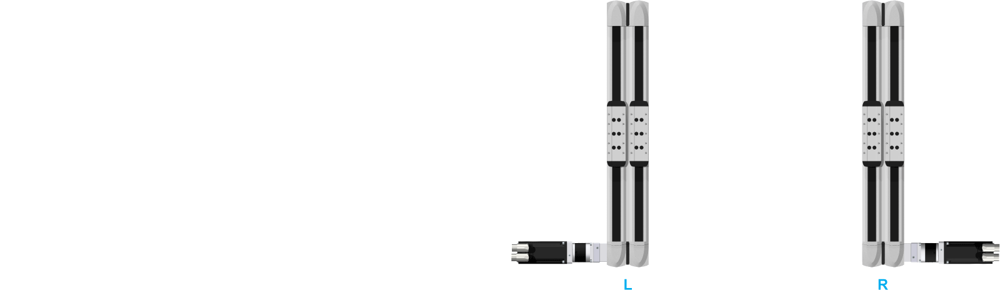
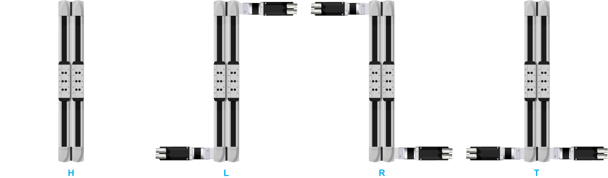
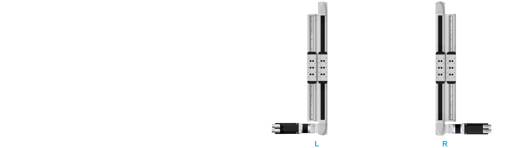

# Mounting Options for the Motor and/or the Gearbox

Mounting Options for the Motor and/or the Gearbox

The following graphic presents the mounting options for the motor and/or the gearbox for the Lexium PAD4-Series.

NOTE: For a PAD42BB or PAD42PB axis without motor, gearbox, or adaptation material: in the [type code](#XREF_D_SE_0104489_1), select L or R as character under Mounting options for motor and/or gearbox to define the position of the [double coupling or the distance plate](ROBOTICS_System_Overview-3.htm#XREF_D_SE_0104485_3).

Lexium PAD42BB

Lexium PAD42EB

Lexium PAD42PB

H   Hollow shaft at both ends (only PAD42EB)

L   On left-hand side

R   On right-hand side

T   On both sides at one end (only PAD42EB)

NOTE: For a detailed name description of the Lexium PAD4-Series, refer to [Type Code](#XREF_D_SE_0104489_1).