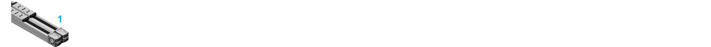
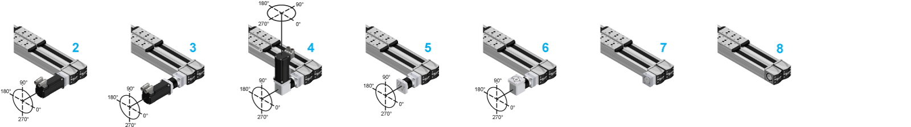
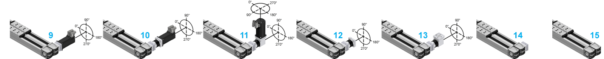

# Motor and/or Gearbox Orientation and Configuration

Motor and/or Gearbox Orientation and Configuration

The following graphics represent the possible motor and/or gearbox orientation and configuration for the Lexium PAD4-Series.

NOTE: For a PAD42BB or PAD42PB axis without motor, gearbox, or adaptation material: in the [type code](#XREF_D_SE_0104489_1), select L or R as character under Mounting options for motor and/or gearbox to define the position of the double coupling or the distance plate.

|  |  |
| --- | --- |
| 1 PAD42EB••••••••••••H/XXXXXXX | |

|  |  |
| --- | --- |
| 2 PAD42•B••••••••••••L/1XXX•••  3 PAD42•B••••••••••••L/2•G••••  4 PAD42•B••••••••••••L/2•A••••  5 PAD42•B••••••••••••L/3•G•XXX | 6 PAD42•B••••••••••••L/3•A•XXX  7 PAD42•B••••••••••••L/4XXX•••  8 PAD42•B••••••••••••L/XXXXXXX |

|  |  |
| --- | --- |
| 9 PAD42•B••••••••••••R/1XXX•••  10 PAD42•B••••••••••••R/2•G••••  11 PAD42•B••••••••••••R/2•A••••  12 PAD42•B••••••••••••R/3•G•XXX | 13 PAD42•B••••••••••••R/3•A•XXX  14 PAD42•B••••••••••••R/4XXX•••  15 PAD42•B••••••••••••R/XXXXXXX |

|  |  |
| --- | --- |
| 16 PAD42EB••••••••••••T/1XXX•••  17 PAD42EB••••••••••••T/2•G••••  18 PAD42EB••••••••••••T/2•A•••• | 19 PAD42EB••••••••••••T/3•G•XXX  20 PAD42EB••••••••••••T/3•A•XXX  21 PAD42EB••••••••••••T/4XXX••• |

For a detailed name description of the Lexium PAD4-Series, refer to [Type Code](#XREF_D_SE_0104489_1).