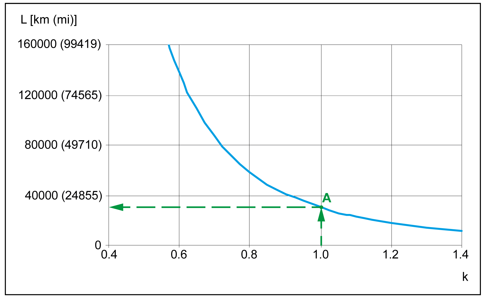

# Service life

Service life

A The forces and torques (Fy, Fz, Mx, Mz, My) are calculated for an expected service life of 30,000 km (18,641 mi). This is shown with k factor equal 1.0 in the figure.