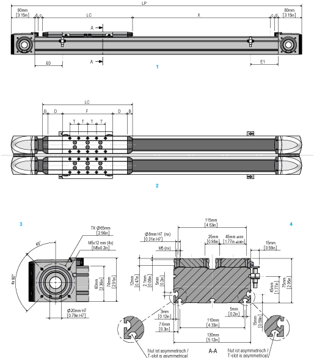

# Dimensional Drawing of Lexium PAD42EB

Dimensional Drawing of Lexium PAD42EB

1   Side view

2   Top view

3   End block

4   Cross-section

| Parameter | Dimension | Unit | Value for Lexium PAD42EB | | | | | |
| --- | --- | --- | --- | --- | --- | --- | --- | --- |
| Carriage type 1 | | Carriage type 2 | | Carriage type 4 | |
| without  cover strip | with  cover strip | without  cover strip | with  cover strip | without  cover strip | with  cover strip |
| Total length of portal axis(1) | LP | mm  (in) | 396 + X  (15.6 + X) | 516 + X  (20.3 + X) | 456 + X  (18 + X) | 576 + X  (22.7 + X) | 576 + X  (22.7 + X) | 696 + X  (27.4 + X) |
| Stroke | X | – | See technical data | | | | | |
| Carriage length | LC | mm  (in) | 206  (8.1) | 303  (12) | 266  (10.5) | 363  (14.3) | 386  (15.2) | 483  (19) |
| Profile length of carriage | F | mm  (in) | 170  (6.7) | | 230  (9) | | 350  (13.8) | |
| Number of tapped holes for mounting(2) | n | – | 10 | | 14 | | 22 | |
| Distance between tapped holes | T | mm  (in) | 30 +/- 0.03  (1.18 +/- 0.00118) | | | | | |
| Sensor position at drive end | E0 | mm  (in) | 33  (1.3) | 93  (3.66) | 33  (1.3) | 93  (3.66) | 33  (1.3) | 93  (3.66) |
| Sensor position opposite drive end | E1 | mm  (in) | 33  (1.3) | 93  (3.66) | 93  (3.66) | 153  (6) | 213  (8.4) | 273  (10.7) |
| Stroke reserve up to mechanical stop | c | mm  (in) | 15  (0.59) | | | | | |
| Length of rubber buffer | B | mm  (in) | 18  (0.71) | | | | | |
| Length of cover strip clamp | d | mm  (in) | – | 11.5  (0.45) | – | 11.5  (0.45) | – | 11.5  (0.45) |
| Length of cover strip deflection | D | mm  (in) | – | 48.5  (1.9) | – | 48.5  (1.9) | – | 48.5  (1.9) |
| Minimum distance between two carriages | – | mm  (in) | 40  (1.57) | 90  (3.54) | 40  (1.57) | 90  (3.54) | 40  (1.57) | 90  (3.54) |
| (1) For axes with more than one carriage, add the carriage length (LC) and the distance between the carriages for each additional carriage.  (2) Prepared for locating dowels. For suitable locating dowels, refer to [Replacement Equipment and Accessories](../ROBOTICS_Replacement_Equipment/ROBOTICS_Replacement_Equipment-1.htm#XREF_D_SE_0065517_1). | | | | | | | | |