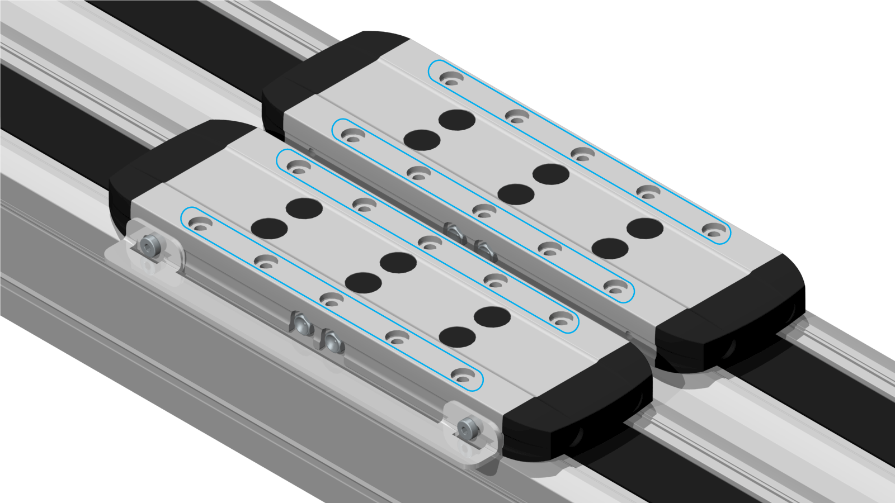

# Overview

Overview

To fasten the payload, fastening threads are provided at the carriage.

Each thread has a counterbore for a locating dowel for reproducible mounting of the payload. For a section view of the carriage, refer to the dimensional drawing of the corresponding axis in [Mechanical Data](../ROBOTICS_Technical_Data/ROBOTICS_Technical_Data-3.htm#XREF_D_SE_0088553_1).

NOTE:

oFor Lexium PAD42PB: remove the carriage connection plate (red color) before mounting the payload.

oFor Lexium PAD42BB and Lexium PAD42PB: connect the carriages to each other in order to achieve the specified forces and torques.

oFor Lexium PAD42EB: do not connect the carriages otherwise the carriages can not move.

oUse locating dowels for reproducible mounting of the payload for:

oLexium PAD42BB and Lexium PAD42PB at one of the two carriages

oLexium PAD42EB at each carriage.

For suitable parts, refer to [Replacement Equipment and Accessories](../ROBOTICS_Replacement_Equipment/ROBOTICS_Replacement_Equipment-1.htm#XREF_D_SE_0065517_1).