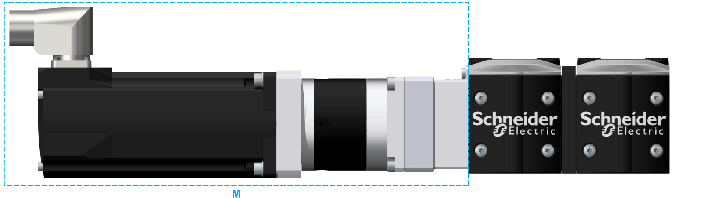

# Maximum Mass

Maximum Mass

The mass of the motor and/or gearbox which can be mounted to the end block is limited.

M   Mass at end block

The following table presents the maximum permissible masses of a mounted motor and/or gearbox:

| Parameter | Unit | Value |
| --- | --- | --- |
| PAD42 |
| Maximum permissible mass | kg (lb) | 15 (33) |

|  |
| --- |
| Warning_Color.gifWARNING |
| UNINTENDED EQUIPMENT OPERATION |
| Do not exceed the maximum permissible mass at the end block. |
| Failure to follow these instructions can result in death, serious injury, or equipment damage. |