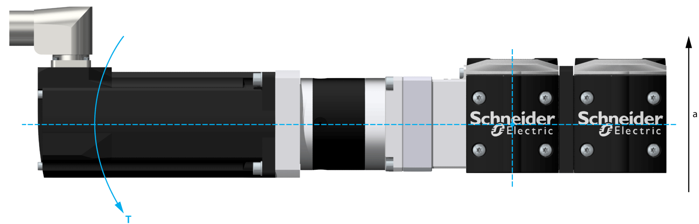

# Maximum Torque

Maximum Torque

A mounted motor and/or gearbox causes a static overturning torque at the end block. In case of a lateral acceleration of the complete axis, the mounted motor and/or gearbox cause an additional dynamic overturning torque. The total of the static and dynamic overturning torque is limited by the maximum overturning torque of the end block.

T   Torque at the end block

a   Lateral acceleration of the axis

The following table presents the maximum permissible torques of the mounted motor and/or gearbox at the end block:

| Parameter | Unit | Value |
| --- | --- | --- |
| PAD42 |
| Maximum permissible torque (total of static and dynamic) | Nm (lbf-in) | 85 (752) |

NOTE: The total of the static and dynamic torques must not exceed the maximum permissible torque at the end block.

|  |
| --- |
| Warning_Color.gifWARNING |
| UNINTENDED EQUIPMENT OPERATION |
| Do not exceed the maximum permissible torque at the end block. |
| Failure to follow these instructions can result in death, serious injury, or equipment damage. |