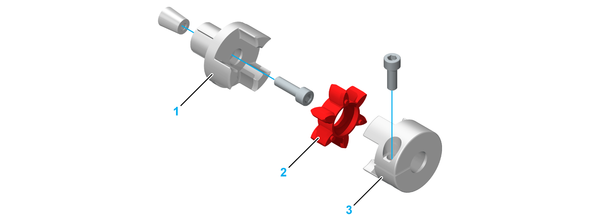

# Coupling for Motor and Gearbox Mounting

Coupling for Motor and Gearbox Mounting

A jaw elastomer coupling is required to mount a motor or gearbox to the axis.

The following graphic presents the components of a jaw elastomer coupling:

1   Expanding hub (1 piece)

2   Elastomer spider (1 piece)

3   Clamping hub (1 piece)