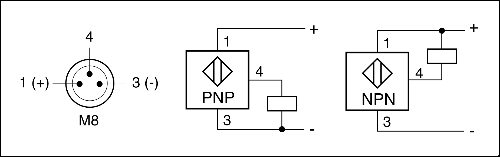

# Connection Details – Sensors

Connection Details – Sensors

The optional sensors are equipped with an M8 x 1 connector. The following graphic presents the connection assignment of the sensors.

| Pin | Description | Color |
| --- | --- | --- |
| 1 | PELV supply voltage (+) | BN (brown) |
| 3 | PELV supply voltage (-) | BU (blue) |
| 4 | Output | BK (black) |

The cable length is 100 mm (3.9 in). For suitable extension cables with various lengths, refer to [Replacement Equipment and Accessories](../ROBOTICS_Replacement_Equipment/ROBOTICS_Replacement_Equipment-1.htm#XREF_D_SE_0065517_1).