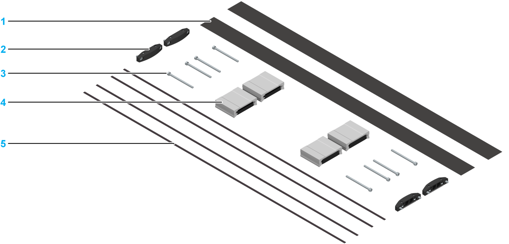

# Parts for Cover Strip Mounting

Parts for Cover Strip Mounting

A set of parts is required to mount the cover strip.

The following graphic presents the components of this set:

1   Cover strip (2 pieces)

2   Cover strip clamp (4 pieces)

3   Hex socket screw (8 pieces)

4   Strip deflector (4 pieces)

5   Magnetic strip (4 pieces)