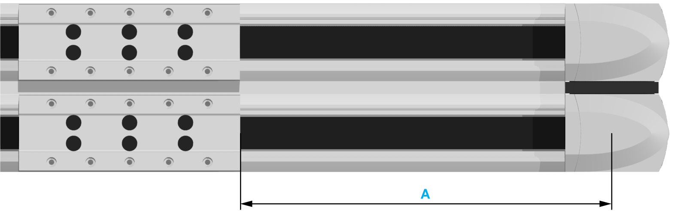

# Distance and Vibration Measurement

Distance and Vibration Measurement

For adjusting the toothed belt tension, you can use either distance measurement or vibration measurement:

oDistance measurement

The position of the toothed belt tensioner is measured with a caliper gauge. The position of the toothed belt tensioner is used to preload the toothed belt.

oVibration measurement

To restore the precise factory-adjusted toothed belt tension, use a belt tension meter for vibration measurement. The factory-adjusted toothed belt tension is presented in the following table. The measured preload values FV depend on the selectable measuring distance A and the weight of the respective toothed belt.

The measuring distance A is measured:

oFrom the center of the end block

oTo the edge of the carriage

| Description | Parameter | Unit | Value |
| --- | --- | --- | --- |
| PAD42 |
| Toothed belt type | – | – | HTD5 |
| Width | – | mm (in) | 25 (0.98) |
| Pitch | – | 5 (0.197) |
| Weight | – | g/m (lb/ft) | 96 (0.065) |
| Toothed belt tension | Fv | N (lbf) | 570…710  (128…160) |

For any questions concerning the vibration measurement, contact your local Schneider Electric service representative.