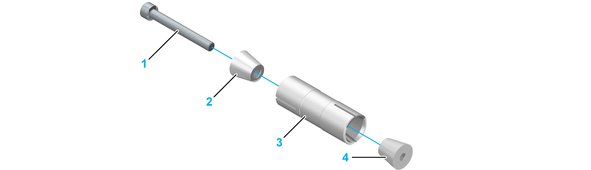

# Overview

Overview

A douple coupling is only mounted in the PAD42BB.

The following graphic presents the components of a double coupling:

1   Screw (1 piece)

2   Front cone (1 piece)

3   Shaft (1 piece)

4   Rear cone (1 piece)