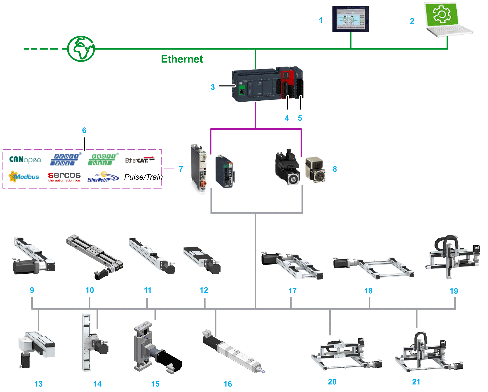
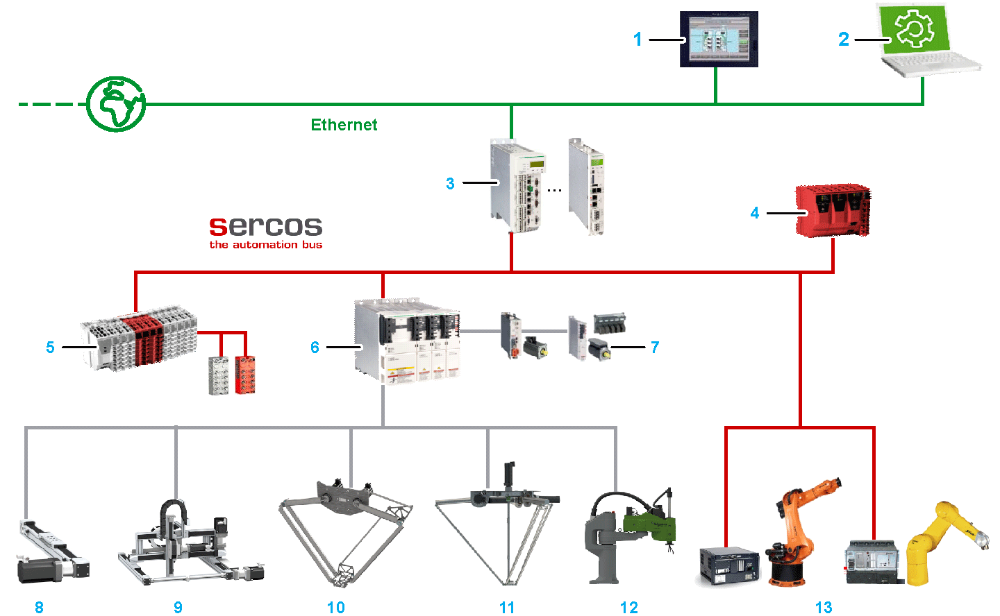

# System Architecture

System Architecture

Overview

The control system consists of several components, depending on its application. The following figure presents an example of a control system.

|  |  |  |
| --- | --- | --- |
| 1 Harmony SCU HMI Controller  2 SoMachine Motion /  EcoStruxure Machine Expert  3 Logic/Motion Controller  4 Safety Module  5 I/O Module  6 Communication Interfaces  7 Drives | 8 Integrated Drives  9 Lexium PAS4•B-Series  10 Lexium PAD4-Series  11 Lexium PAS4•S-Series  12 Lexium TAS4-Series  13 Lexium CAS2-Series  14 Lexium CAS4-Series  15 Lexium CAR4-Series  16 Lexium EAC1-Series | 17 Lexium MAXH-Series  18 Lexium MAXS-Series  19 Lexium MAXP-Series  20 Lexium MAXR•2-Series  21 Lexium MAXR•3-Series |

For more information about the several components, refer to the corresponding documentation at www.schneider-electric.com.

The following figure presents an example of a PacDrive 3 system.

|  |  |
| --- | --- |
| 1 Harmony SCU HMI Controller  2 EcoStruxure Machine Expert  3 Motion Controller  4 Safety Controller  5 I/O  6 Drives  7 Motors | 8 Single Axes (CAR, CAS, EAC, PAD, PAS, TAS)  9 Multi-Axis Systems (MAXH, MAXS, MAXP, MAXR)  10 Delta-2 Robots (Lexium T)  11 Delta-3 Robots (Lexium P)  12 SCARA Robots (Lexium S)  13 Articulated Robots |

For more information about the several components, refer to the corresponding documentation at www.schneider-electric.com.

EIO0000004366.00

© 2020 Schneider Electric. All rights reserved.